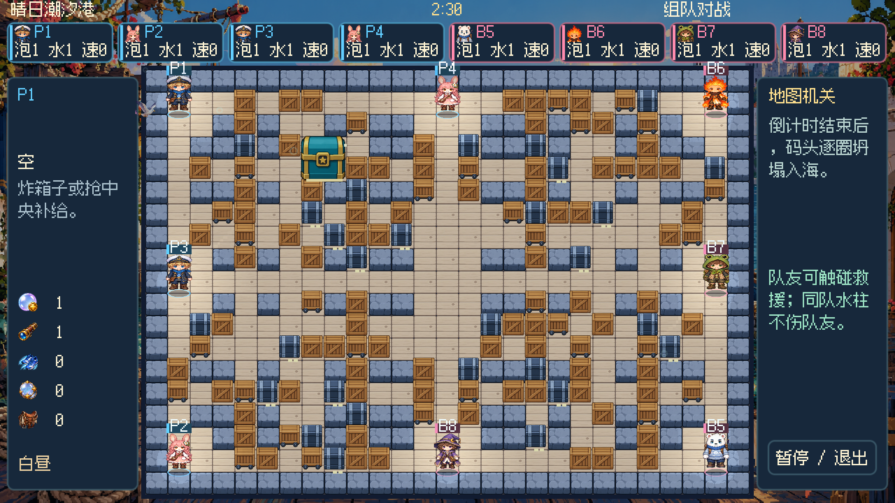
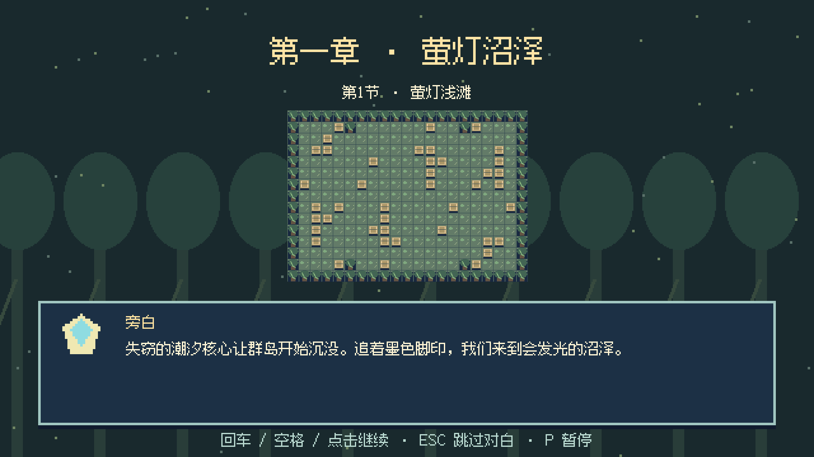
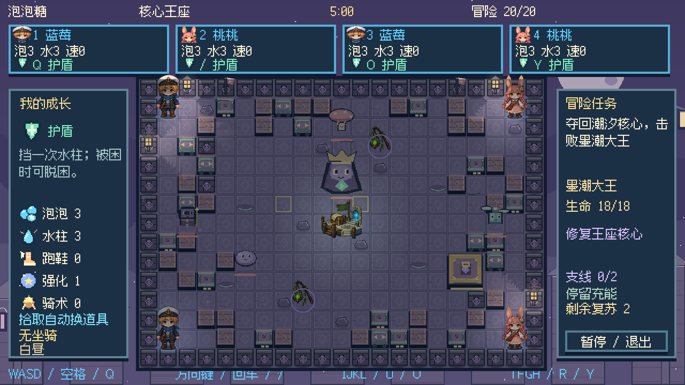
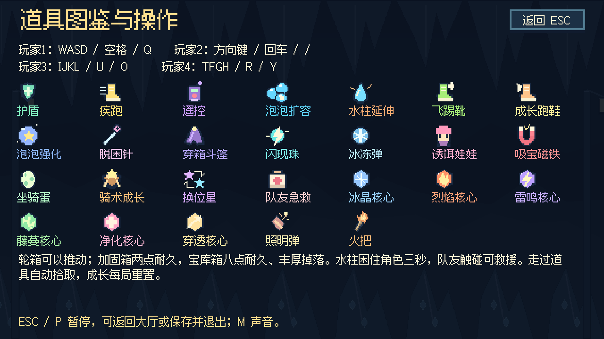
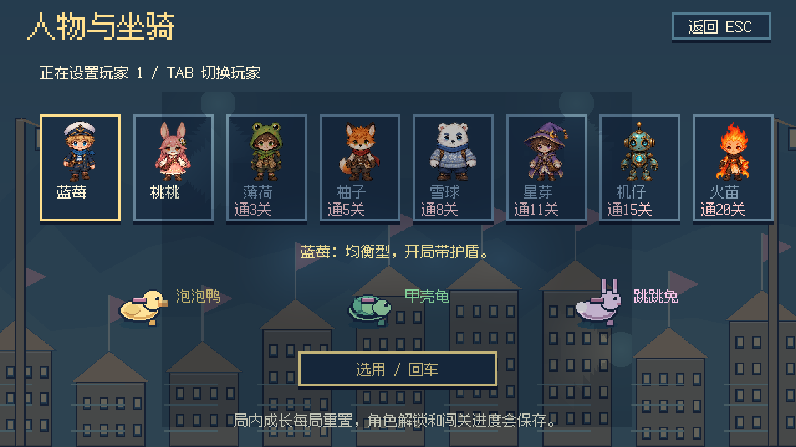
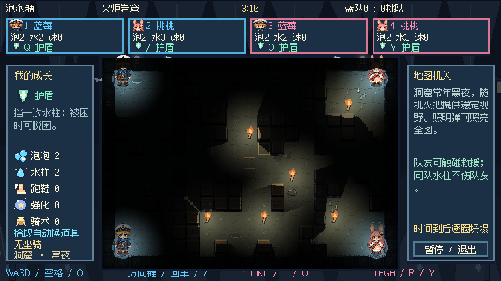
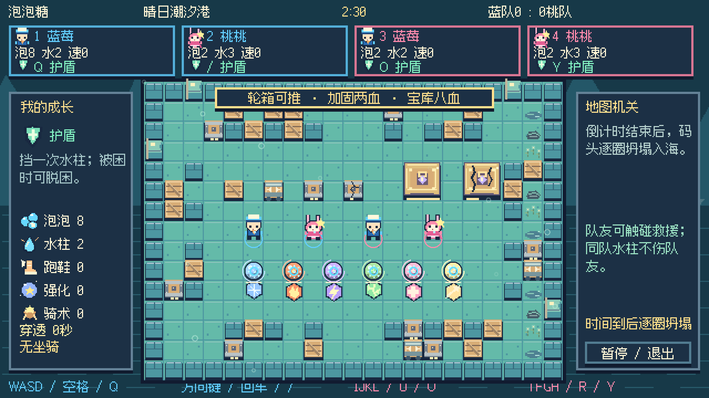
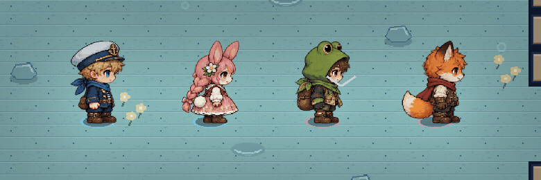
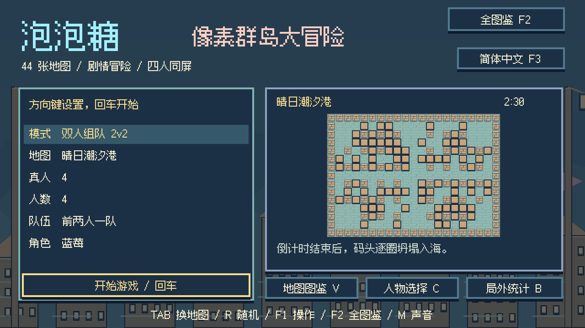

<div align="center">

# 🫧 泡泡糖

### 像素群岛大冒险

**放一颗泡泡，救一位伙伴，找回群岛失去的光。**


[开始游戏](#start) · [四种玩法](#modes) · [剧情冒险](#story) · [操作说明](#controls) · [菜单与大厅](docs/菜单与大厅设计.md) · [完整手册](docs/玩法说明.md)



</div>

用 Godot 制作的中文像素泡泡对战游戏。从两个人共用一块键盘开始，也可以带上电脑队友，探索五章群岛故事，或者来一场八人混战。

v4.6 为现有六种怪物与五个 Boss 增加逐帧待机、左右移动、攻击、受击和倒地动作，共 396 帧。攻击蓄力与实际伤害时机同步，冰冻和暂停会停住相应动画，图鉴也显示动态待机。

v4.5 将地图扩大到 27×19 格，对战支持最多八人，其中真人最多四人，空位由电脑补齐；组队支持 2v2、3v3、4v4。开局统一一颗泡泡、一格射程，普通地图保持白昼，指定地图才有昼夜或迷雾。角色缩小并补充困泡、破泡、倒地贴图；队友和敌人的触碰救援、击杀均即时生效，被困窗口为八秒。主菜单、八席位大厅与局内信息栏重新整理。

圆滚滚的泡泡会连锁爆炸；同伴被困时，碰到他就能救援。捡成长道具、抢坐骑、利用地图机关，还要留意倒计时：时间一到，地图会逐圈向内坍塌。

| 🗺️ 地图 | 🎒 道具 | 🧑 人物 | 🐣 坐骑 | 🎵 音乐 |
| :---: | :---: | :---: | :---: | :---: |
| 44 张机关地图 | 26 种常规道具 | 8 位可解锁角色 | 鸭、龟、兔 | 14 首主题 BGM |

游戏画面渲染为 1080p。十四个主题使用正交地图与清晰的地面、墙和箱体层次。地图、方块、装饰、背景，十一种怪物与 Boss，全部道具、泡泡、坐骑和任务物件均接入新生成的精细像素素材。八位人物拥有四方向共 408 张独立行走帧，并补充正面放置与受击帧。美术使用内置 imagegen 制作，音乐和音效由项目制作；字体授权说明见文末。

<a id="start"></a>
## 🚀 开始游戏

```sh
git clone git@github.com:WhiteRobe/My-Paopaotang.git
cd My-Paopaotang
```

安装 **Godot 4.x**，在项目管理器中导入根目录的 `project.godot`，打开工程后按 **F5**。项目使用 Compatibility 渲染器，无需额外插件；已在 Godot 4.7.2 上检查导入与启动。

如果 Godot 已加入命令行路径，也可以直接运行：

```sh
godot --path .
```

> 仓库提供源码和运行所需的图片、音频、字体。Godot 运行时、可执行程序、安装包与导出缓存不提交到 Git。

<details>
<summary><b>macOS：自行打包为可双击的应用</b></summary>

准备 Python 3、Pillow 和 Xcode Command Line Tools，然后执行：

```sh
python3 -m pip install Pillow
mkdir -p dist
python3 tools/build_macos.py /Applications/Godot.app/Contents/MacOS/Godot
```

脚本生成 `dist/泡泡糖.app` 与 `dist/泡泡糖-macOS.zip`，包含运行时和游戏资源。启动器支持 Apple Silicon 与 Intel；引擎架构取决于传入的 Godot 程序。打包后可双击应用或 `启动游戏.command`。

应用使用本地签名，未做 Apple 公证。其他桌面平台可通过 Godot 安装对应导出模板后自行导出。

</details>

<a id="modes"></a>
## 🎮 四种玩法

| 模式 | 适合怎么玩 |
| --- | --- |
| **剧情冒险 PVE** | 一到四名真人，可由 Bot 补足队伍。五章二十节，完成收集、救援、点灯、护送、守点与波次战，挑战五位 Boss |
| **单人闯关** | 二十关逐步增加难度。可以带电脑队友，也可以独自挑战多名敌人 |
| **自由混战** | 两到四个席位，真人与 Bot 混合，各自为战，先赢两局夺冠 |
| **2v2 组队** | 四个席位，支持前两人同队或交叉分组，协作救援、包围对手 |

对战可指定地图，也可随机选图，每局重新抽取。全部地图都能在地图图鉴中浏览。

传送环、滑冰、水流、弹床、激光、陨星、列车、棱镜、漩涡、浮桥和瞄准炮台会改变局势。机关先给出危险提示，再发动攻击。对战倒计时为 150～210 秒，剧情关卡为 270～300 秒；归零后，每五秒向内坍塌一圈。

<a id="story"></a>
## 🌙 归航之光

潮汐核心失窃，群岛正在下沉。蓝莓和伙伴沿着墨色脚印出发，救回被控制的居民与守护者，寻找让王城灯塔重新亮起的方法。

| 章节 | 旅途 | 关底 Boss |
| --- | --- | --- |
| **第一章 · 萤灯沼泽** | 从浅滩走向毒蕈小径，穿过旋叶营地 | 苔冠树王 |
| **第二章 · 回声遗迹** | 解开棱镜、尖刺与回声石阵 | 砂钟守卫 |
| **第三章 · 珊瑚深庭** | 在潮流与漩涡之间营救居民 | 铁钳蟹将 |
| **第四章 · 风帆空港** | 护送车辆，跨越断桥，迎击空中威胁 | 雷翼飞艇 |
| **第五章 · 墨潮王城** | 点亮暗灯街区，夺回潮汐核心 | 墨潮大王 |

每节包含对白和任务目标，全部支持中、英、日、法、德五种语言。收集物需运回检查点，营救需持续靠近一秒，灯柱需依次点亮，护送途中需补充能量。每节另有两处支线目标，完成后获得属性充能、护盾和存档奖章。怪物与 Boss 有生命值，Boss 在半血后加快攻击。完成任务后，真人进入发光出口才能过关；章节进度独立保存，可以重玩已经解锁的关卡。

<table>
<tr>
<td width="50%"></td>
<td width="50%"></td>
</tr>
<tr><td align="center">旅途从一段中文对白开始</td><td align="center">机关、任务与 Boss 同场登场</td></tr>
</table>

## 🎒 成长、坐骑与救援

扩容、延伸水柱、跑鞋和泡泡强化提升本局能力。飞踢靴能踢走泡泡，遥控器能提前引爆，闪现珠帮你脱离包围。地上的主动道具会与手持道具交换，成长道具和坐骑蛋则直接生效。

泡泡鸭擅长奔跑，甲壳龟能承受更多伤害，跳跳兔可以跨越箱子。坐骑有四方向四帧动画，骑手随步伐起伏，坐骑先替角色承受水柱，骑术成长还能提高速度与耐久。

队友被困时，触碰即可救援；自己也能用脱困针或护盾脱身。剧情模式还有每关共享的复苏次数。**角色当前采用被困、救援和复苏规则；生命值系统用于怪物与 Boss。**



蓝莓、桃桃、薄荷、柚子、雪球、星芽、机仔和火苗有各自的外观与初始能力。随着闯关解锁更多伙伴，人物选择会随存档保留。



## 🔦 昼夜、迷雾与洞窟

普通地图每 90 秒经历白天、黄昏、夜晚和黎明。夜里主要依靠角色周围约三格的视野；墙与箱子会遮光，泡泡在爆炸前的最后 1.2 秒逐渐变亮，连环爆炸也会照亮水柱附近。

新增四张常夜洞窟地图：火炬岩窟、迷雾矿道、地下暗河、蝠影回音厅。每局随机生成六处固定火把，位置整局保持不变，持续照亮附近地形。洞窟有岩晶、蘑菇、钟乳石与飞过的蝙蝠，并使用独立的洞窟回声音乐。

迷雾按 60 秒周期生成随机漂移的雾团，再由风吹散。夜晚和迷雾中可拾取两个新道具，用原有道具键使用：**照明弹**让全图明亮八秒；**火把**让自身视野扩大到约六格，持续二十秒。两种道具也能用于灯塔熄灭期间。

海港与空港有海鸥，森林与沼泽有蝴蝶，深海有鱼群，工厂有蒸汽，星空有流星，其他主题也有对应的环境动画。



## 📦 箱子也有脾气

包含普通箱、可推箱、需要两次命中的装甲箱，以及占据 **2×2 格、需要八次命中** 的宝库箱。箱子随地图主题更换像素造型，受损后出现裂纹；宝库箱有独立的大尺寸像素画与耐久条，一次爆炸无论覆盖几格都只扣一点耐久。破坏后掉落四至六件奖励，包含坐骑、属性核心和成长道具；加固箱有两枚耐久指示，轮箱带车轮并可连续推动。十四个地图主题各有对应的箱体配色，受损分阶段显示裂纹。

六种属性核心让泡泡改变颜色与效果：冰晶冻结、烈焰扩大中心冲击、雷鸣跳跃电弧、藤蔓留下减速区、净化救援与保护、穿透越过第一只箱子。使用核心可充能二十秒，同时改变已放置的己方泡泡。新增核心使用原有道具键，玩家一 Q、玩家二 /。已检查箱体推动、两次与八次命中、六件奖励保留、六种核心使用，以及 44 张地图和 20 节剧情的对局结算。



<a id="controls"></a>
## ⌨️ 一起开玩

| 操作 | 玩家一 | 玩家二 | 玩家三 | 玩家四 |
| --- | :---: | :---: | :---: | :---: |
| 移动 | WASD | 方向键 | IJKL | TFGH |
| 放泡泡 | 空格 | 回车 | U | R |
| **使用道具** | **Q** | **/** | **O** | **Y** |

- **大厅**：上下选择设置，左右调整，回车开始；支持鼠标操作。
- **C / B / V / F1**：人物、统计、地图图鉴、道具与操作说明。
- **F2**：完整图鉴，167 个条目涵盖道具、人物、坐骑、怪物、方块、机关、地图和任务；左右切分类、上下选条目。
- **F3**：选择中文、English、日本語、Français、Deutsch，界面、剧情和图鉴立即切换。
- **TAB / R**：对战大厅顺序换图 / 随机选图。
- **ESC / P**：暂停，可继续、返回大厅或保存后退出。
- **M**：切换声音；**Shift + 道具键**：手动交换脚下主动道具。
- **剧情对白**：回车或空格继续，ESC 跳过，P 暂停。

玩家二也支持数字键盘回车和除号。游戏采用本机同屏，真人和 Bot 可以混合配置。

## 💾 保存你的冒险

自动保存剧情与经典闯关进度、人物解锁、角色选择、声音、语言设置、支线奖章和局外统计。统计包含胜负、泡泡、炸箱、拾取、救援、骑乘、怪物与 Boss 击败数量等。

macOS 存档位置：

```text
~/Library/Application Support/paopaotang/profile.json
```

其他平台可在 Godot 的 `user://` 目录找到 `profile.json`。中途返回大厅会保留已保存的关卡进度，下次从当前关卡重新开始。

## 🛠️ 项目结构

```text
.
├── project.godot          # Godot 工程入口
├── main.tscn             # 主场景
├── game.gd               # 对战、输入、Bot、菜单与存档
├── adventure.gd          # 剧情任务、怪物与 Boss
├── map_mechanisms.gd     # 地图机关
├── crates.gd             # 箱体、推动、耐久与奖励
├── bubble_effects.gd     # 属性泡泡与水柱效果
├── world_effects.gd      # 环境装饰与特效
├── weather.gd            # 昼夜、迷雾、风、火把与照明弹
├── dynamic_lighting.gd   # 光源、阴影和迷雾着色器
├── hd_art.gd             # HD 图集索引与动作帧
├── hero_palette.gd       # 人物配色与头像缓存
├── menu_ui.gd            # 菜单、大厅、设置与存档管理
├── encyclopedia.gd       # 完整图鉴
├── i18n.gd               # Godot 翻译注册与语言切换
├── locales/              # 五种语言的离线译文
├── data/                 # 地图、人物、道具与中文剧情
├── assets/               # 原创像素图片、音频和中文字体
├── tools/                # 美术、音乐生成与 macOS 打包脚本
├── docs/                 # 玩法手册与精选实机截图
└── licenses/             # 第三方授权声明
```

<details>
<summary><b>重新制作素材与音乐</b></summary>

工程中的资源可以直接运行。当前 HD 图集的来源与更新方法见 [资源制作](docs/资源制作.md)，更新原图后运行 `python3 tools/index_hd_atlases.py`。下面的旧素材生成器供维护参考，会覆盖目标文件，按需执行；音乐压缩需要 ffmpeg。

```sh
python3 -m pip install Pillow numpy
python3 tools/draw_pixel_art.py
python3 tools/create_adventure_art.py
python3 tools/create_effect_art.py
python3 tools/create_crate_art.py
python3 tools/create_detailed_world.py
python3 tools/create_detailed_crates.py
python3 tools/create_mount_animation.py
python3 tools/create_weather_art.py
python3 tools/create_hero_art.py
python3 tools/create_creature_art.py
python3 tools/index_premium_atlases.py
python3 tools/create_assets.py
python3 tools/compose_themes.py
```

`assets/audio/themes/catalog.json` 记录主题音乐名称、节拍和时长。十四个音乐主题覆盖海港、森林、冰雪、沙漠、火山、工厂、糖果、星空、沼泽、遗迹、深海、空港、王城和洞窟，每首约两到三分钟。

</details>

本轮人物、动作与战斗画面的改动见 [美术升级计划](docs/美术升级计划.md)。



更多规则、道具效果与地图机关，请查看 [完整玩法说明](docs/玩法说明.md)。

开发与 AI 协作请从 [AGENTS.md](AGENTS.md) 和 [开发文档](docs/README.md) 开始。统一检查入口为 `python3 tools/harness.py check`，环境、运行与构建说明见 [harness 使用说明](docs/harness.md)。`.uid`、导入缓存、素材和临时文件的处理见 [文件与资源管理](docs/文件与资源管理.md)。

## 🌱 后续方向

- 打磨属性核心对泡泡、水柱、敌人与机关的联动。
- 完善剧情角色生命值、受伤反馈与倒地救援。
- 继续打磨箱体互动与剧情关卡平衡。

## 🎨 素材与授权

游戏美术、音乐和音效由本项目制作；精细人物与任务图集的提示词见 [制作记录](assets/hd/GENERATION.md)。中文字体使用开源的 [缝合像素字体](https://github.com/TakWolf/fusion-pixel-font)，字体组件声明与 Godot 授权文件保存在 [licenses](licenses/) 中。

<div align="center">



**下一颗泡泡，记得给队友留条路。**

</div>


v4.6：自由移动与尺寸修正

角色可以斜向移动、随时转向，松键停在格子内任意位置，保留短促加速与制动。脚底碰撞体与墙箱、泡泡及其他角色交互，泡泡仍就近放在格子上，触碰救援与击杀保持即时生效。

地图道具缩至 12×12 逻辑像素，保留原图纵横比；HUD 为 13×13、背包为 22×22，不再让拾取物跨越一格。人物菜单整帧改为等比例显示，正面图集重新排列为 4×2，扩大透明间隔；脚底与阴影统一锚点，站立去掉整体上下浮动。八席位各有服装主题色，五官与主要造型保留，HUD 和局内编号显示个人颜色，组队地面环保持队伍颜色。

修正后的 [道具画面](docs/screenshots/v46-items.png)、[角色主题色](docs/screenshots/v46-player-palettes.png)、[模式菜单](docs/screenshots/v46-menu.png) 与 [怪物动画](docs/screenshots/v46-monster-animation.gif)。


v4.6.1：局内通知移到地图外的左侧信息栏，三秒后消退并恢复道具说明。通知在五种语言下限制换行和宽度，地图上不再出现横幅。[实机画面](docs/screenshots/v461-notice-sidebar.png)。


v4.6.2：运行与操作优化（2026-10-04）

实机场景复现并修复了冰冻怪物仍在滑动、怪物在抵达角色前触发接触伤害、冰冻角色跳过水柱伤害、水流和阵风推力间歇中断、跳跃坐骑落地后继续执行旧位移，以及关门判定忽略格内脚底位置的问题。切出游戏窗口会进入暂停，需要手动继续。

界面长说明限制行数，过长单词与标签不会越界。剧情侧栏显示支线目标、支线进度和复苏次数，数字留有独立位置；同步五语言。冰冻覆盖层降低不透明度，角色本体更清楚。[中文画面](docs/screenshots/v462-pve-sidebar.png)、[德文布局](docs/screenshots/v462-pve-de.png)。
