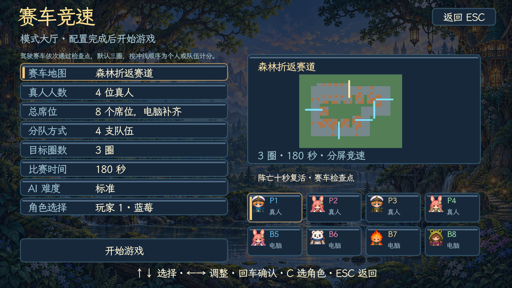
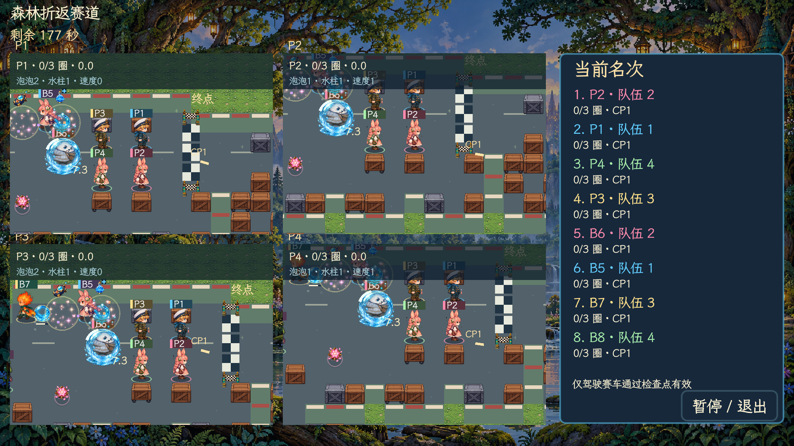
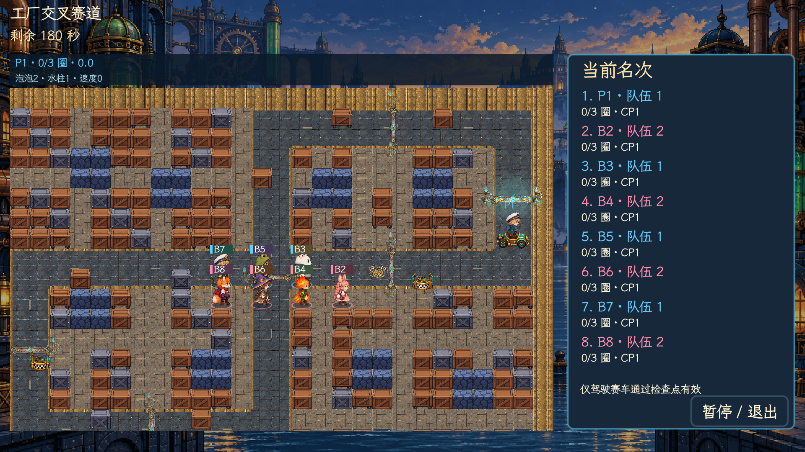
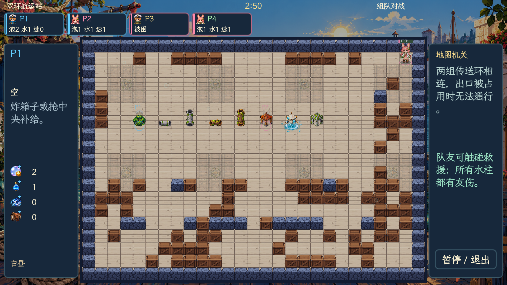
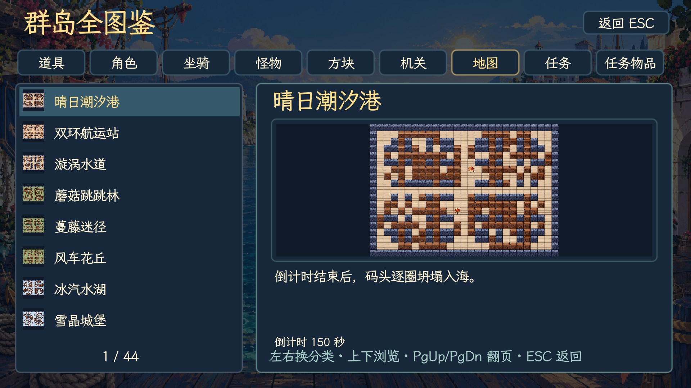
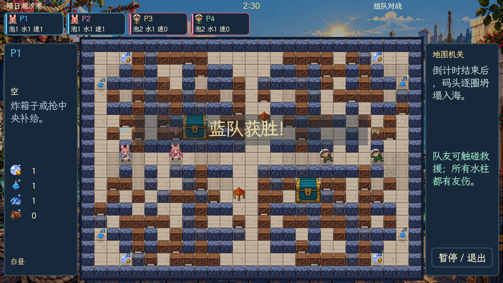

<div align="center">

# 🫧 泡泡糖

### 像素群岛大冒险 · v4.9.9

**放一颗泡泡，救一位伙伴，找回群岛失去的光。**


[开始游戏](#start) · [四种玩法](#modes) · [剧情冒险](#story) · [操作说明](#controls) · [开发文档](docs/README.md)


</div>

用 Godot 制作的中文像素泡泡对战游戏。可以和朋友共用一块键盘，带上电脑队友探索五章群岛故事，也可以来一场八人混战。

| 🗺️ 地图 | 🎒 道具 | 🧑 人物 | 🐣 坐骑 | 🎵 音乐 |
| :---: | :---: | :---: | :---: | :---: |
| 44 张机关地图＋3 张赛道 | 26 种常规道具＋PVE 高压核心＋2 种稀有道具＋赛车 | 8 位可解锁角色 | 鸭、龟、兔 | 41 首完整配乐＋回合乐句 |

地图、角色、怪物、道具和机关使用精细像素素材。人物拥有四方向行走、放置、受击、困泡和倒地动作；十一种怪物与 Boss 使用逐帧动画。箱子、门、角色、坐骑和任务物件按落地位置统一遮挡，八位角色分别拥有鸭、龟、兔和赛车的四方向完整骑乘动画。

> 本页保留部分 v4.7.2 截图作为玩法展示；标注 v4.8.0 的图片展示结算演出、藏身掩体与地图图鉴；v4.9.1 图片展示赛车大厅与分屏。GIF 为实际对局的缩小预览。

<a id="start"></a>
## 🚀 开始游戏

```sh
git clone git@github.com:WhiteRobe/My-Paopaotang.git
cd My-Paopaotang
```

安装 **Godot 4.x**，在项目管理器中导入根目录的 `project.godot`，打开工程后按 **F5**。项目使用 Compatibility 渲染器，无需额外插件；开发检查使用 Godot 4.7.2。

如果 Godot 已加入命令行路径：

```sh
godot --path .
```

仓库包含源码及运行所需的图片、音乐、音效和字体。引擎运行时、可执行程序、安装包和导入缓存不提交到 Git。

<details>
<summary><b>macOS：打包为可双击的应用</b></summary>

准备 Python 3、Pillow 和 Xcode Command Line Tools：

```sh
python3 -m pip install Pillow
mkdir -p dist
python3 tools/build/build_macos.py /Applications/Godot.app/Contents/MacOS/Godot
```

输出为 `dist/泡泡糖.app` 与 `dist/泡泡糖-macOS.zip`。启动器支持 Apple Silicon 与 Intel，引擎架构取决于传入的 Godot 程序；打包后可双击应用或 `启动游戏.command`。

应用使用本地签名，未做 Apple 公证。其他桌面平台可在 Godot 安装对应导出模板后自行导出。

</details>

<a id="modes"></a>
## 🎮 四种玩法

| 模式 | 怎么玩 |
| --- | --- |
| **剧情冒险 PVE** | 一到四名真人，可由 Bot 补足队伍。五章二十节，营救居民、收集交付、点灯、护送、守点、迎战波次与 Boss |
| **单人闯关** | 一名真人挑战二十关竞技地图，逐步解锁角色；部分关卡可以带电脑队友 |
| **赛车竞速** | 两到八个席位，最多四名真人独立分屏，依次通过检查点、计圈并按冲线顺序计分 |
| **组队对战** | 两到八个席位分为最多八队，人数可不等；每人一队即混战，先赢两局夺冠 |

点击大厅中的任意活跃席位，可选择角色、真人或 Bot；对战和赛车均可指定所属队伍。自由混战已合并到组队对战。真人控制按席位顺序分配，设置页会显示对应的「控制 1～4」。配置随存档保存，旧存档也能继续使用。

AI 有轻松、标准、挑战三档。Bot 先避险，再根据安全路径距离选择击杀或救援：距离相近时优先击杀，队友明显更近时先救援；标准与挑战难度还会利用敌人的救援路线布置陷阱。

对战可指定地图或每局随机抽图，全部地图都能在图鉴中浏览。大厅按 **A** 打开高级规则，可设置坍塌开始时间、坍塌速度、昼夜、雾气、箱子密度、道具掉落量和地图机关。洞窟始终为夜晚。

<table>
<tr>
<td width="50%"></td>
<td width="50%"></td>
</tr>
<tr><td align="center">安排真人与电脑伙伴</td><td align="center">每个席位都能单独设置</td></tr>
</table>

## 🏎️ 赛车竞速与飞艇空投

海港内湾、森林折返、工厂交叉三张赛道均为 28×19 格，主赛道宽两格、外围只留一格边界。路线分别采用内凹码头、连续折返和交叉双环；内场分布固定掩体、阻击小路和避险支路，三图分别有 111、102、145 格箱子。默认三圈、180 秒，大厅可调整为一至九圈、60 至 600 秒。单人显示完整地图，多人各用独立镜头；右侧排名栏集中显示圈数、三维成长数值与所属队伍，数值栏不再占用赛场顶部。

开局徒步炸箱，收集泡泡数量、水柱范围和速度提升，再获取赛车。赛车在所有可通行地面均能起步加速：主赛道基础极速 6 格/秒，内场与支路 2.52 格/秒；赛道约 0.6 秒加到基础最高速，非赛道加速更慢。转向保留少量惯性，松键后短距离滑行，碰墙后可迅速脱离。只有驾驶赛车按顺序通过检查点才有效。箱内奖励中赛车占 35%、三维成长占 55%，其余进入常规道具池。另有两处位于赛道外、连接主路的固定领车补给湾，开局十二秒后开始供车、每三十秒补货；飞艇也会偶尔投车。阵亡十秒后在最近已通过检查点附近复活，复活后需重新取得赛车。

完成目标圈数后按冲线顺序获得八至一分，队伍分数为成员分数之和。非赛道最高车速约为赛道的 42%，加速更慢；驶离赛道会逐步减速，回到赛道重新提速。时间归零立即结束，不加时；未完成目标圈数者零分，按截止时已有积分结算。车手冲线后面向屏幕，原地起伏庆祝并飘出星光，等待其他选手完成。全员完成或时间归零后先播放结束演出，再显示名次、个人得分和队伍总分。

所有玩法中偶尔有飞艇飞过并随机投下带降落伞的补给；**赛车图的飞艇只投赛车**，其他地图投放普通掉落池中的道具。





海港、森林与工厂采用各自的地面材质和路沿。检查点使用符文门槛与晶石灯，下一检查点亮起青金色光芒与流动箭头，过点后原检查线立即熄灭，下一条检查线亮起，并播放确认音效。检查线与其他世界物件同步震动。场内移除检查点文字牌，分屏数值栏移到赛场外。三首竞速曲分别对应三张图，最后三十秒切换专属冲线曲。赛车 AI 优先取车、分阶段过弯，错过检查点会从入口侧重新通过；普通和困难 AI 会择机干扰前方对手，并控制投泡泡频率。



本次修复向右移动时的人物镜像偏移，并重绘横纵向树干、水泥管，见 [镜像与通道修复](docs/镜像与通道-v4.9.9.md)。前版紧凑界面、油量倒计时与行走对齐调整见 [界面与行走修复](docs/界面与行走-v4.9.8.md)。前版赛车限时、地图与动作更新见 [全局地图与移动](docs/地图与移动-v4.9.7.md)。前版统一队伍配色、修复倒计时音乐抢播，并让赛车先承受一次爆炸，见 [队伍与音频修复](docs/队伍与音频-v4.9.6.md)。前版骑乘、死亡掉落与界面更新见 [骑乘与掉落更新](docs/骑乘与掉落-v4.9.5.md)。前版路线与操作修复见 [赛车路线与驾驶修复](docs/赛车路线与驾驶-v4.9.4.md)，上一版美术、音乐与内场更新见 [赛车美术与音乐](docs/赛车美术与音乐-v4.9.3.md)，上一版检查点与 AI 调整见 [两格赛道、检查点与赛车 AI](docs/赛车检查点与AI-v4.9.2.md)，上一版手感调整见 [赛车手感与紧凑地图](docs/赛车手感与紧凑地图-v4.9.1.md)，计圈和积分规则见 [赛车与多队伍更新](docs/赛车与多队伍更新-v4.9.0.md)。

<a id="story"></a>
## 🌙 归航之光

潮汐核心失窃，群岛正在下沉。蓝莓和伙伴沿着墨色脚印出发，救回被控制的居民与守护者，寻找让王城灯塔重新亮起的方法。

| 章节 | 旅途 | 关底 Boss |
| --- | --- | --- |
| **第一章 · 萤灯沼泽** | 从浅滩走向毒蕈小径，穿过旋叶营地 | 苔冠树王 |
| **第二章 · 回声遗迹** | 解开棱镜、尖刺与回声石阵 | 砂钟守卫 |
| **第三章 · 珊瑚深庭** | 在潮流与漩涡之间营救居民 | 铁钳蟹将 |
| **第四章 · 风帆空港** | 护送车辆，跨越断桥，迎击空中威胁 | 雷翼飞艇 |
| **第五章 · 墨潮王城** | 点亮暗灯街区，夺回潮汐核心 | 墨潮大王 |

二十节任务使用横向、纵向、L 形和分区地图，尺寸包括 51×19、27×37、43×31、47×29 格。镜头跟随队伍滚动，小地图帮助判断方向，镜头边界限制队员走散。

收集物需带回交付点，营救需持续靠近一秒，信标需按顺序用水柱点亮，护送途中需补充能量。每节另有两处支线，完成后获得奖励和存档奖章。任务完成后，真人进入发光出口才能过关；章节进度独立保存，可以重玩已解锁关卡。

怪物、Boss、坐骑和护送车用单排红色方格显示生命值，底色半透明。最大生命值不超过十点时每格一点；超过十点时保留十格比例条，旁边显示红心与准确剩余血量。**角色采用困泡、救援和复苏规则。** PVE 的高压核心每件增加一点对怪物的泡泡伤害，最多三级，可从一伤害成长到四伤害；烈焰仍有额外伤害，箱体所需爆炸次数保持原规则。

界面、对白和图鉴支持中文、英语、日语、法语、德语。

<table>
<tr>
<td width="50%"></td>
<td width="50%"></td>
</tr>
<tr><td align="center">旅途从一段中文对白开始</td><td align="center">和伙伴探索大地图、挑战守护者</td></tr>
</table>

## 🎒 成长、坐骑与泡泡

扩容、延伸水柱、跑鞋、骑术成长和 PVE 伤害提升图标右上角有蓝色加号。死亡后，本局实际吃过的成长与稀有道具会沿抛物线飞向地图随机有效落点，落地后可重新拾取；初始角色属性不算拾取道具。队伍采用青龙、白虎、朱雀、玄武、麒麟、凤凰、苍狼、玉兔八个名称。主动道具占一个手持槽，空手自动拾取；有道具时靠近会显示 E / . / ; / V，按键才交换，旧道具留在地上。成长道具和坐骑蛋直接生效。局内成长每局重置，角色解锁和闯关进度长期保存。

泡泡鸭固定速度二级、一格耐久；甲壳龟固定最低速度、两格耐久；跳跳兔固定最高速度、一格耐久，可跨越单格墙箱，连续跑八格后休息一秒，蓝色条显示耐力，停下来可恢复耐力。坐骑基础速度不受人物速度成长影响；骑术成长每次修复一点当前坐骑耐久，不提高固定速度或血量上限。人物之间可以穿行，触碰被困队友仍会救援，触碰被困敌人则将其击败。

普通泡泡**有友伤**，也会困住放置者和队友；净化水柱可以救援己方。泡泡在**爆炸瞬间**结算人物和怪物伤害，范围内已有泡泡立即连爆。随后水柱余波只播放动画，走入余波或在余波中放新泡泡不会受伤或连爆；激光等地图危险按各自规则生效。被困后有八秒救援窗口，也可使用脱困针或护盾脱身。


八位角色保留小幅初始差异，对战与 PVE 使用相同基础属性：

| 角色 | 泡泡数量 | 水柱范围 | 速度等级 |
| --- | :---: | :---: | :---: |
| 蓝莓、雪球、机仔 | 2 | 1 | 0 |
| 桃桃、柚子 | 1 | 1 | 1 |
| 薄荷、星芽、火苗 | 1 | 2 | 0 |

选人界面和每个席位均支持「随机」，每局开始时抽取一次；真人从已解锁角色中抽取，Bot 可抽取全部角色。人物连续移动，基础步行速度全模式再降 30%，现约为每秒 2.59 格，玩家之间不会互相卡位。

死亡时会散出本局实际吃过的泡泡扩容、水柱延伸、速度提升、骑术成长、高压核心和坐骑道具，也会散出下面两种稀有道具；角色基础属性不算掉落。已有坐骑时仍可重复吃坐骑道具，不替换或恢复当前坐骑，所有拾取记录在死亡时逐个飞散。

| 稀有道具 | 拾取效果 |
| --- | --- |
| **大力丸** | 水柱范围直接扩至整行、整列，仍受墙体和箱子阻挡 |
| **邪魔面具** | 50% 概率操作反向二十秒；50% 概率升至六颗泡泡、最高速度、整行整列水柱 |

两种稀有道具拾取后立即生效，普通掉落中各约占 1%。水柱延伸使用蓝色水滴瓶图标，瓶内带扩散水纹。


## 📦 箱子也有脾气

普通箱和可推轮箱一击破坏，装甲箱需要两击。推动轮箱需持续顶住约 0.22 秒，随后用 0.26 秒移动一格。**2×2 宝库箱需要八次命中**，同一次爆炸覆盖几格都只扣一点耐久。满血箱体隐藏耐久标记，受损后显示红色方格。

宝库破坏后，空间足够时掉落四至六件奖励，包括坐骑、属性核心和成长道具。爆炸会摧毁范围内已有的掉落，但同次爆炸刚释放的箱内奖励会保留，后续爆炸仍可摧毁。

六种属性核心改变泡泡效果：冰晶冻结、烈焰冲击、雷鸣电弧、藤蔓减速、净化救援、穿透箱体。核心使用原有道具键，充能二十秒，也会改变已经放置的己方泡泡。藤蔓核心留下的减速区域不影响己方，友方藤蔓显示为半透明。


## 🌿 藏身与地图探索

地图按主题布置不可摧毁的藏身掩体：森林有灌木与空心树干，工厂有水泥管，其他主题还有小屋、帐篷和石屋。对战地图每张有二至八处对称藏身点；PVE 保留任务与护送路线。藏身不能躲过水柱伤害。

| 掩体 | 通行与水柱规则 |
| --- | --- |
| 灌木、小屋、帐篷、石屋 | 四向可进出，水柱也能进入 |
| 横向或纵向水泥管、空心树干 | 仅两端开口可通行；侧壁挡住人物、泡泡和水柱 |

进入掩体后，人物、坐骑和头顶编号隐藏，敌方 AI 不会透视追踪，己方保留淡轮廓。**多人共享屏幕目前按第一名真人所在队伍显示轮廓**；AI 各自按自身阵营判断。



图鉴将任务物品与普通道具分开，地图和任务页右侧显示实际布局预览，可在开局前查看路线。



## 🔦 机关、昼夜与最后三十秒

传送、水流、滑冰、弹床、激光、陨星、列车、棱镜、漩涡、浮桥和炮台会改变局势。激光有黄色充能警示、红白光束、火花和余辉。传送带顺向加速、逆向减速，允许逆行。漩涡每六秒短暂吸引一次，提前 1.5 秒预警，只将周围三格内的泡泡朝最近漩涡拉动一格。

普通地图保持白昼，指定地图才有昼夜或迷雾。四张洞窟地图常年黑夜，每局随机布置六处固定落地灯柱。夜里墙与箱子会遮光；照明弹照亮全图八秒，手持火把扩大自身视野二十秒。白昼关闭人物、泡泡与水柱的局部光，真实发光机关仍保留光效。


十四个主题各有约两到三分钟的 BGM，覆盖海港、森林、冰雪、沙漠、火山、工厂、糖果、星空、沼泽、遗迹、深海、空港、王城和洞窟。开局 2.5 秒播放准备乐句，最后三十秒切换紧张音乐，计时变红。普通对战默认规则下，倒计时归零后每五秒向内坍塌一圈，已坍塌区域显示流动虚空迷雾与边缘闪电；尸体半透明，被虚空吞没时下坠消失。对战高级规则可调整开始时间与速度。

## 🏆 回合结束与统计

胜负确定后，先播放约 3.8 秒的结束演出：胜利队伍面向屏幕欢呼，仍存活的败者低头，获胜横幅淡入淡出。音乐先切换胜负乐句，再进入统计页的专属循环配乐。

统计页列出每名真人与 Bot 的击杀、救援次数，PVE 另列怪物击败数。完整配乐共四十一首，另有开局与回合乐句。



<a id="controls"></a>
## ⌨️ 一起开玩

| 操作 | 控制一 | 控制二 | 控制三 | 控制四 |
| --- | :---: | :---: | :---: | :---: |
| 移动 | WASD | 方向键 | IJKL | TFGH |
| 放泡泡 | 空格 | 回车 | U | R |
| **使用道具** | **Q** | **/** | **O** | **Y** |
| 确认拾取／更换 | E | .（句号） | ;（分号） | V |

键位按真人席位顺序分配，查看席位设置中的控制编号。控制二也支持数字键盘回车和除号。

- **大厅**：键盘或鼠标配置模式、地图、难度和席位，回车开始。
- **C / B / V / F1**：人物、统计、地图图鉴、道具与操作说明。
- **F2 / F3**：完整图鉴／语言选择。
- **TAB / R**：对战大厅顺序换图／随机选图。
- **ESC / P**：暂停，可继续、返回大厅或保存后退出；切出窗口也会暂停。
- **M**：切换声音；**Shift＋道具键**：手动交换脚下主动道具。
- **剧情对白**：回车或空格继续，ESC 跳过，P 暂停。

## 💾 保存你的冒险

自动保存经典与剧情进度、人物解锁、席位与队伍配置、AI 难度、音量、语言、支线奖章和局外统计。中途返回大厅会保留已保存进度，下次从当前关卡重新开始。

macOS 存档位置：

```text
~/Library/Application Support/paopaotang/profile.json
```

其他平台使用 Godot 的 `user://profile.json`。详细规则见 [完整玩法手册](docs/玩法说明.md)。

## 🛠️ 开发与资源制作

```text
.
├── project.godot          # Godot 工程入口
├── scenes/main.tscn       # 主场景
├── scripts/
│   ├── core/             # 共享状态、输入、对局循环与存档
│   ├── gameplay/         # 剧情、泡泡、箱体、机关与天气
│   ├── render/           # 图集、角色配色、遮挡、镜头与照明
│   ├── ui/               # 菜单、大厅、图鉴与国际化
│   └── data/             # 地图、人物、道具与中文剧情
├── assets/               # art 分类美术、audio 分类音频、字体与 shader
├── locales/              # 五语言离线目录
├── tools/                # art、audio、i18n、build、checks；harness 统一入口
├── docs/                 # 开发文档、玩法手册与精选截图
└── licenses/             # 第三方授权声明
```

从 [AGENTS.md](AGENTS.md) 和 [开发文档](docs/README.md) 开始，统一命令见 [harness 使用说明](docs/harness.md)：

```sh
export GODOT_BIN=/Applications/Godot.app/Contents/MacOS/Godot
python3 tools/harness.py doctor
python3 tools/harness.py check
python3 tools/harness.py run
python3 tools/harness.py pack
```

运行已有素材无需重新生成。修改素材前阅读 [资源制作](docs/资源制作.md)；当前 HD 图集的提示词与来源见 [制作记录](docs/art-production/GENERATION.md)。图集原图更新后，用 `python3 tools/art/index_atlases.py` 重建裁切索引。生成器会覆盖对应资源，请按需执行。

本项目使用 `res://` 路径引用，`.uid`、`.import` 和 `.godot/` 均忽略。引擎、安装包、临时截图、日志和检查存档不提交，文件规则见 [文件与资源管理](docs/文件与资源管理.md)。启动检查不代表全部剧情已经逐关通关，验收范围见 [开发与验收](docs/开发与验收.md)。


## ✨ 最近更新

| 版本 | 主要变化与详细记录 |
| --- | --- |
| **v4.9.9** | 修正向右镜像的人物偏移；空心树干、水泥管采用横纵独立视角。 |
| **v4.9.8** | 撤掉高侧栏、底部紧凑席位条，油量倒计时与最后 30 秒警示，固定侧身行走画布。 |
| **v4.9.7** | 赛车归零结束、非赛道明显减速；亭子、帐篷与石亭改为正向视角。 |
| **v4.9.6** | 角色、编号、脚底圈与界面统一队伍色；修复赛车倒计时音乐反复切换；开车受炸先损毁赛车。 |
| **v4.9.5** | 八角色与四种载具共 32 组完整骑乘动画；成长与稀有道具死亡飞散；完整赛车视野、赛道外领车湾、冲线庆祝和命名队伍。[骑乘与掉落](docs/骑乘与掉落-v4.9.5.md) |
| **v4.9.4** | 三种赛道路线、阻击与避险支路、固定掩体、赛道领车湾，修复检查线震动同步、过线熄灭和内场驾驶速度。[路线与驾驶](docs/赛车路线与驾驶-v4.9.4.md) |
| **v4.9.3** | 重做赛车地面与检查点美术、移出遮挡 HUD、开放内场并增加箱子和赛车奖励，新增四首赛车配乐。[美术与音乐](docs/赛车美术与音乐-v4.9.3.md) |
| **v4.9.2** | 赛道缩为 28×19、两格宽、外围一格；重做检查点提示，修正半格偏差和赛车 Bot 弯口来回摆动。[检查点与 AI](docs/赛车检查点与AI-v4.9.2.md) |
| **v4.9.1** | 赛车地图缩为 35×25、三格主车道，开局炸箱成长、取消免费起跑车，优化转向、刹停与绕箱 AI。[手感与紧凑地图](docs/赛车手感与紧凑地图-v4.9.1.md) |
| **v4.9.0** | 三张赛车地图、检查点计圈、积分结算、十秒复活、赛车惯性、真人分屏、飞艇空投与最多八队。[赛车与多队伍更新](docs/赛车与多队伍更新-v4.9.0.md) |
| **v4.8.0** | 主题藏身点、回合结束演出与配乐、角色初始差异、随机选人、稀有道具、死亡掉落、图鉴预览、移动与 AI 调整。[玩法与结算更新](docs/玩法与结算更新-v4.8.0.md) |
| **v4.7.9** | 中文手写字体、主动道具确认更换、成长标记与回合统计。[字体与拾取更新](docs/字体与拾取更新-v4.7.9.md) |
| **v4.7.8** | 高级规则、地图掩体、人物与环境动画、洞窟灯柱和半透明血条。[画面与规则更新](docs/画面与规则更新-v4.7.8.md) |
| **v4.7.7** | 血条改为单排，超过十点时保留十格并显示准确剩余血量 |
| **v4.7.6** | 新增二十一首原创配乐，覆盖主题变奏、前端与章节 Boss。[配乐扩充与试听](docs/配乐扩充-v4.7.6.md) |
| **v4.7.5** | 调整成长、掉落、坐骑、属性攻击与 PVE 队伍缩放。[平衡调整](docs/平衡调整-v4.7.5.md) |
| **v4.7.3–4.7.4** | 护送车抵达出口后消失，统一水柱与藤蔓素材，增加怪物和 Boss 技能动画 |
| **v4.7.0–4.7.2** | PVE 扩图与镜头、伤害成长、方格血条、逐席位配置、统一遮挡与瞬时爆炸伤害 |

制作和运行记录见 [开发与验收](docs/开发与验收.md)。

## 🎨 素材与授权

游戏美术使用内置 imagegen 制作，音乐与音效由本项目制作。中文界面使用圆润手写风格的 [霞鹜文楷屏幕阅读版](https://github.com/lxgw/LxgwWenKai-Screen)，其他语言与缺字回退使用 [Noto Sans CJK](https://github.com/notofonts/noto-cjk)，通过 Godot MSDF 在 1080p 保持清晰。字体与 Godot 授权文件保存在 [licenses](licenses/) 中。

<div align="center">


**下一颗泡泡，记得给队友留条路。**

</div>
