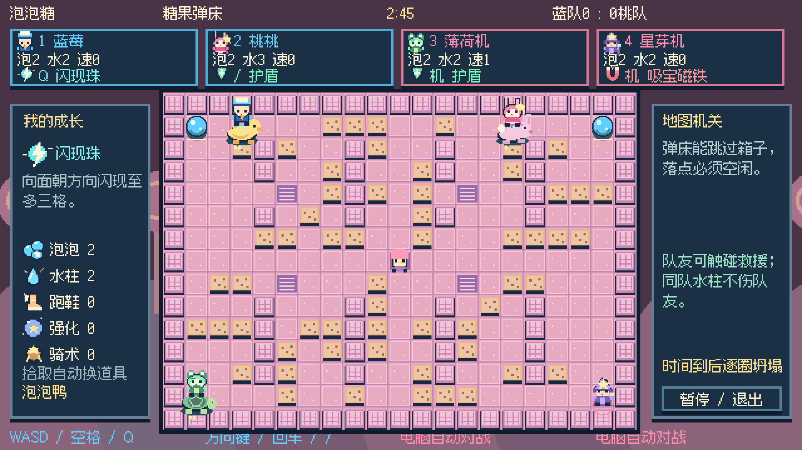

<div align="center">

# 🫧 泡泡糖

### 像素群岛大冒险

**放一颗泡泡，救一位伙伴，找回群岛失去的光。**


[开始游戏](#start) · [四种玩法](#modes) · [剧情冒险](#story) · [操作说明](#controls) · [完整手册](docs/玩法说明.md)



</div>

用 Godot 制作的中文像素泡泡对战游戏。从两个人共用一块键盘开始，也可以带上电脑队友，探索五章群岛故事，或者来一场四人混战。

圆滚滚的泡泡会连锁爆炸；同伴被困时，碰到他就能救援。捡成长道具、抢坐骑、利用地图机关，还要留意倒计时：时间一到，地图会逐圈向内坍塌。

| 🗺️ 地图 | 🎒 道具 | 🧑 人物 | 🐣 坐骑 | 🎵 音乐 |
| :---: | :---: | :---: | :---: | :---: |
| 40 张机关地图 | 18 种常规道具 | 8 位可解锁角色 | 鸭、龟、兔 | 13 首主题 BGM |

像素人物、地图、道具、音乐和音效由项目自行制作。中文像素字体的授权说明见文末。画面以像素整数倍放大到 1080p，人物有连续移动、方向动画、拾取反馈和水花特效。

<a id="start"></a>
## 🚀 开始游戏

```sh
git clone git@github.com:WhiteRobe/My-Paopaotang.git
cd My-Paopaotang
```

安装 **Godot 4.x**，在项目管理器中导入根目录的 `project.godot`，打开工程后按 **F5**。项目使用 Compatibility 渲染器，无需额外插件；已在 Godot 4.7.2 上检查导入与启动。

如果 Godot 已加入命令行路径，也可以直接运行：

```sh
godot --path .
```

> 仓库提供源码和运行所需的图片、音频、字体。Godot 运行时、可执行程序、安装包与导出缓存不提交到 Git。

<details>
<summary><b>macOS：自行打包为可双击的应用</b></summary>

准备 Python 3、Pillow 和 Xcode Command Line Tools，然后执行：

```sh
python3 -m pip install Pillow
mkdir -p dist
python3 tools/build_macos.py /Applications/Godot.app/Contents/MacOS/Godot
```

脚本生成 `dist/泡泡糖.app` 与 `dist/泡泡糖-macOS.zip`，包含运行时和游戏资源。启动器支持 Apple Silicon 与 Intel；引擎架构取决于传入的 Godot 程序。打包后可双击应用或 `启动游戏.command`。

应用使用本地签名，未做 Apple 公证。其他桌面平台可通过 Godot 安装对应导出模板后自行导出。

</details>

<a id="modes"></a>
## 🎮 四种玩法

| 模式 | 适合怎么玩 |
| --- | --- |
| **剧情冒险 PVE** | 一到四名真人，可由 Bot 补足队伍。五章二十节，完成收集、救援、点灯、护送、守点与波次战，挑战五位 Boss |
| **单人闯关** | 二十关逐步增加难度。可以带电脑队友，也可以独自挑战多名敌人 |
| **自由混战** | 两到四个席位，真人与 Bot 混合，各自为战，先赢两局夺冠 |
| **2v2 组队** | 四个席位，支持前两人同队或交叉分组，协作救援、包围对手 |

对战可指定地图，也可随机选图，每局重新抽取。全部地图都能在地图图鉴中浏览。

传送环、滑冰、水流、弹床、激光、陨星、列车、棱镜、漩涡、浮桥和瞄准炮台会改变局势。机关先给出危险提示，再发动攻击。对战倒计时为 150～210 秒，剧情关卡为 270～300 秒；归零后，每五秒向内坍塌一圈。

<a id="story"></a>
## 🌙 归航之光

潮汐核心失窃，群岛正在下沉。蓝莓和伙伴沿着墨色脚印出发，救回被控制的居民与守护者，寻找让王城灯塔重新亮起的方法。

| 章节 | 旅途 | 关底 Boss |
| --- | --- | --- |
| **第一章 · 萤灯沼泽** | 从浅滩走向毒蕈小径，穿过旋叶营地 | 苔冠树王 |
| **第二章 · 回声遗迹** | 解开棱镜、尖刺与回声石阵 | 砂钟守卫 |
| **第三章 · 珊瑚深庭** | 在潮流与漩涡之间营救居民 | 铁钳蟹将 |
| **第四章 · 风帆空港** | 护送车辆，跨越断桥，迎击空中威胁 | 雷翼飞艇 |
| **第五章 · 墨潮王城** | 点亮暗灯街区，夺回潮汐核心 | 墨潮大王 |

每节包含中文对白和任务目标。怪物与 Boss 有生命值，Boss 在半血后加快攻击。完成任务后，真人进入发光出口才能过关；章节进度独立保存，可以重玩已经解锁的关卡。

<table>
<tr>
<td width="50%"></td>
<td width="50%"></td>
</tr>
<tr><td align="center">旅途从一段中文对白开始</td><td align="center">机关、任务与 Boss 同场登场</td></tr>
</table>

## 🎒 成长、坐骑与救援

扩容、延伸水柱、跑鞋和泡泡强化提升本局能力。飞踢靴能踢走泡泡，遥控器能提前引爆，闪现珠帮你脱离包围。地上的主动道具会与手持道具交换，成长道具和坐骑蛋则直接生效。

泡泡鸭擅长奔跑，甲壳龟能承受更多伤害，跳跳兔可以跨越箱子。坐骑先替角色承受水柱，骑术成长还能提高速度与耐久。

队友被困时，触碰即可救援；自己也能用脱困针或护盾脱身。剧情模式还有每关共享的复苏次数。**角色当前采用被困、救援和复苏规则；生命值系统用于怪物与 Boss。**


蓝莓、桃桃、薄荷、柚子、雪球、星芽、机仔和火苗有各自的外观与初始能力。随着闯关解锁更多伙伴，人物选择会随存档保留。


## 📦 箱子也有脾气

当前源码包含普通箱、可推箱、需要两次命中的装甲箱，以及占据 **2×2 格、需要八次命中** 的宝库箱。箱子随地图主题更换像素造型，受损后出现裂纹；宝库破坏后掉落坐骑与成长等奖励。

六种属性核心已接入当前源码：冰晶冻结、烈焰扩大中心冲击、雷鸣跳跃电弧、藤蔓留下减速区、净化救援与保护、穿透越过第一只箱子。**这部分和最新箱子内容尚未完成完整对局验收**，当前源码作为持续开发版本发布。

<a id="controls"></a>
## ⌨️ 一起开玩

| 操作 | 玩家一 | 玩家二 | 玩家三 | 玩家四 |
| --- | :---: | :---: | :---: | :---: |
| 移动 | WASD | 方向键 | IJKL | TFGH |
| 放泡泡 | 空格 | 回车 | U | R |
| **使用道具** | **Q** | **/** | **O** | **Y** |

- **大厅**：上下选择设置，左右调整，回车开始；支持鼠标操作。
- **C / B / V / F1**：人物、统计、地图图鉴、道具与操作说明。
- **TAB / R**：对战大厅顺序换图 / 随机选图。
- **ESC / P**：暂停，可继续、返回大厅或保存后退出。
- **M**：切换声音；**Shift + 道具键**：手动交换脚下主动道具。
- **剧情对白**：回车或空格继续，ESC 跳过，P 暂停。

玩家二也支持数字键盘回车和除号。游戏采用本机同屏，真人和 Bot 可以混合配置。

## 💾 保存你的冒险

自动保存剧情与经典闯关进度、人物解锁、角色选择、声音设置和局外统计。统计包含胜负、泡泡、炸箱、拾取、救援、骑乘、怪物与 Boss 击败数量等。

macOS 存档位置：

```text
~/Library/Application Support/paopaotang/profile.json
```

其他平台可在 Godot 的 `user://` 目录找到 `profile.json`。中途返回大厅会保留已保存的关卡进度，下次从当前关卡重新开始。

## 🛠️ 项目结构

```text
.
├── project.godot          # Godot 工程入口
├── main.tscn             # 主场景
├── game.gd               # 对战、输入、Bot、菜单与存档
├── adventure.gd          # 剧情任务、怪物与 Boss
├── map_mechanisms.gd     # 地图机关
├── crates.gd             # 箱体、推动、耐久与奖励
├── bubble_effects.gd     # 属性泡泡与水柱效果
├── world_effects.gd      # 环境装饰与特效
├── data/                 # 地图、人物、道具与中文剧情
├── assets/               # 原创像素图片、音频和中文字体
├── tools/                # 美术、音乐生成与 macOS 打包脚本
├── docs/                 # 玩法手册与精选实机截图
└── licenses/             # 第三方授权声明
```

<details>
<summary><b>重新制作素材与音乐</b></summary>

已提交的资源可以直接运行。需要修改和重新生成时，安装 Python 3、Pillow、numpy；音乐压缩还需要 ffmpeg。

```sh
python3 -m pip install Pillow numpy
python3 tools/draw_pixel_art.py
python3 tools/create_adventure_art.py
python3 tools/create_effect_art.py
python3 tools/create_crate_art.py
python3 tools/create_assets.py
python3 tools/compose_themes.py
```

`assets/audio/themes/catalog.json` 记录主题音乐名称、节拍和时长。十三个音乐主题覆盖海港、森林、冰雪、沙漠、火山、工厂、糖果、星空、沼泽、遗迹、深海、空港和王城，每首约两到三分钟。

</details>

更多规则、道具效果与地图机关，请查看 [完整玩法说明](docs/玩法说明.md)。

## 🌱 后续方向

- 打磨属性核心对泡泡、水柱、敌人与机关的联动。
- 完善剧情角色生命值、受伤反馈与倒地救援。
- 继续打磨箱体互动，补充关卡与多人对局验收。

## 🎨 素材与授权

游戏像素画、音乐和音效由本项目制作。中文字体使用开源的 [缝合像素字体](https://github.com/TakWolf/fusion-pixel-font)，字体组件声明与 Godot 授权文件保存在 [licenses](licenses/) 中。

<div align="center">


**下一颗泡泡，记得给队友留条路。**

</div>
