<div align="center">

# 🫧 泡泡糖

### 像素群岛大冒险 · v4.8.0

**放一颗泡泡，救一位伙伴，找回群岛失去的光。**


[开始游戏](#start) · [四种玩法](#modes) · [剧情冒险](#story) · [操作说明](#controls) · [开发文档](docs/README.md)

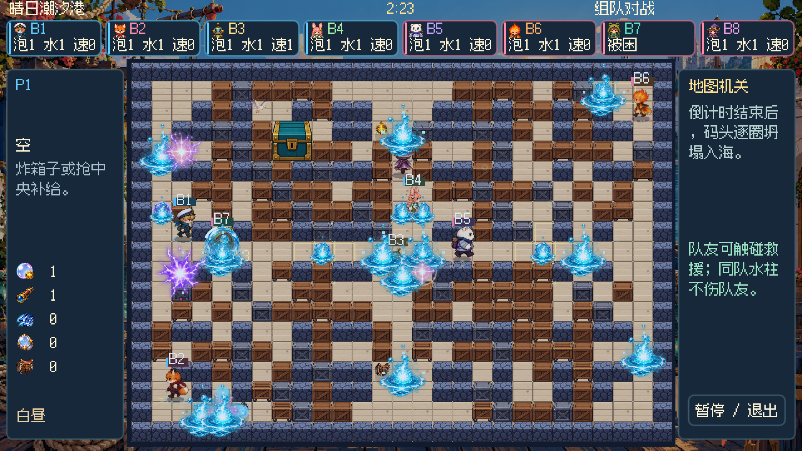

</div>

用 Godot 制作的中文像素泡泡对战游戏。可以和朋友共用一块键盘，带上电脑队友探索五章群岛故事，也可以来一场八人混战。

| 🗺️ 地图 | 🎒 道具 | 🧑 人物 | 🐣 坐骑 | 🎵 音乐 |
| :---: | :---: | :---: | :---: | :---: |
| 44 张机关地图 | 26 种常规道具＋PVE 高压核心＋2 种稀有道具 | 8 位可解锁角色 | 鸭、龟、兔 | 37 首完整配乐＋回合乐句 |

地图、角色、怪物、道具和机关使用精细像素素材。人物拥有四方向行走、放置、受击、困泡和倒地动作；十一种怪物与 Boss 使用逐帧动画。箱子、门、角色、坐骑和任务物件按落地位置统一遮挡，骑乘时人物上半身与鞍位一起起伏。

> 本页主体静态截图截取自 v4.7.2，分辨率为 1920×1080；GIF 是实际对局的缩小预览。

<a id="start"></a>
## 🚀 开始游戏

```sh
git clone git@github.com:WhiteRobe/My-Paopaotang.git
cd My-Paopaotang
```

安装 **Godot 4.x**，在项目管理器中导入根目录的 `project.godot`，打开工程后按 **F5**。项目使用 Compatibility 渲染器，无需额外插件；开发检查使用 Godot 4.7.2。

如果 Godot 已加入命令行路径：

```sh
godot --path .
```

仓库包含源码及运行所需的图片、音乐、音效和字体。引擎运行时、可执行程序、安装包和导入缓存不提交到 Git。

<details>
<summary><b>macOS：打包为可双击的应用</b></summary>

准备 Python 3、Pillow 和 Xcode Command Line Tools：

```sh
python3 -m pip install Pillow
mkdir -p dist
python3 tools/build/build_macos.py /Applications/Godot.app/Contents/MacOS/Godot
```

输出为 `dist/泡泡糖.app` 与 `dist/泡泡糖-macOS.zip`。启动器支持 Apple Silicon 与 Intel，引擎架构取决于传入的 Godot 程序；打包后可双击应用或 `启动游戏.command`。

应用使用本地签名，未做 Apple 公证。其他桌面平台可在 Godot 安装对应导出模板后自行导出。

</details>

<a id="modes"></a>
## 🎮 四种玩法

| 模式 | 怎么玩 |
| --- | --- |
| **剧情冒险 PVE** | 一到四名真人，可由 Bot 补足队伍。五章二十节，营救居民、收集交付、点灯、护送、守点、迎战波次与 Boss |
| **单人闯关** | 一名真人挑战二十关竞技地图，逐步解锁角色；部分关卡可以带电脑队友 |
| **自由混战** | 两到八个席位，最多四名真人，各自为战，先赢两局夺冠 |
| **组队对战** | 四、六或八个席位分成两队，可逐席位指定阵营，协作救援和包围对手 |

点击大厅中的任意活跃席位，可选择角色、真人或 Bot；组队时还能指定队伍。真人控制按席位顺序分配，设置页会显示对应的「控制 1～4」。配置随存档保存，旧存档也能继续使用。

AI 有轻松、标准、挑战三档。对战可指定地图或每局随机抽图，全部地图都能在图鉴中浏览。

<table>
<tr>
<td width="50%">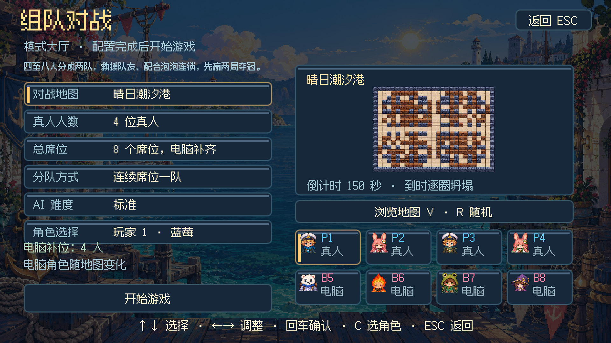</td>
<td width="50%">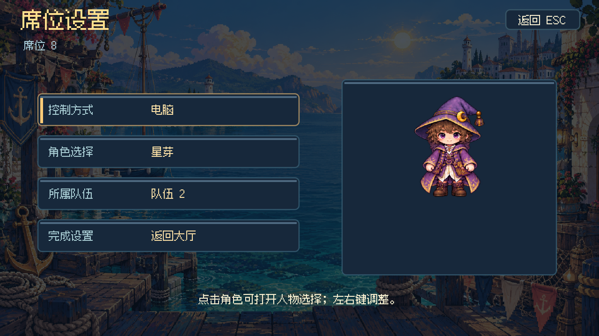</td>
</tr>
<tr><td align="center">安排真人与电脑伙伴</td><td align="center">每个席位都能单独设置</td></tr>
</table>

<a id="story"></a>
## 🌙 归航之光

潮汐核心失窃，群岛正在下沉。蓝莓和伙伴沿着墨色脚印出发，救回被控制的居民与守护者，寻找让王城灯塔重新亮起的方法。

| 章节 | 旅途 | 关底 Boss |
| --- | --- | --- |
| **第一章 · 萤灯沼泽** | 从浅滩走向毒蕈小径，穿过旋叶营地 | 苔冠树王 |
| **第二章 · 回声遗迹** | 解开棱镜、尖刺与回声石阵 | 砂钟守卫 |
| **第三章 · 珊瑚深庭** | 在潮流与漩涡之间营救居民 | 铁钳蟹将 |
| **第四章 · 风帆空港** | 护送车辆，跨越断桥，迎击空中威胁 | 雷翼飞艇 |
| **第五章 · 墨潮王城** | 点亮暗灯街区，夺回潮汐核心 | 墨潮大王 |

二十节任务使用横向、纵向、L 形和分区地图，尺寸包括 51×19、27×37、43×31、47×29 格。镜头跟随队伍滚动，小地图帮助判断方向，镜头边界限制队员走散。

收集物需带回交付点，营救需持续靠近一秒，信标需按顺序用水柱点亮，护送途中需补充能量。每节另有两处支线，完成后获得奖励和存档奖章。任务完成后，真人进入发光出口才能过关；章节进度独立保存，可以重玩已解锁关卡。

怪物、Boss、坐骑和护送车用红色方格显示生命值。**角色采用困泡、救援和复苏规则。** PVE 的高压核心每件增加一点对怪物的泡泡伤害，最多三级，可从一伤害成长到四伤害；烈焰仍有额外伤害，箱体所需爆炸次数保持原规则。

界面、对白和图鉴支持中文、英语、日语、法语、德语。

<table>
<tr>
<td width="50%">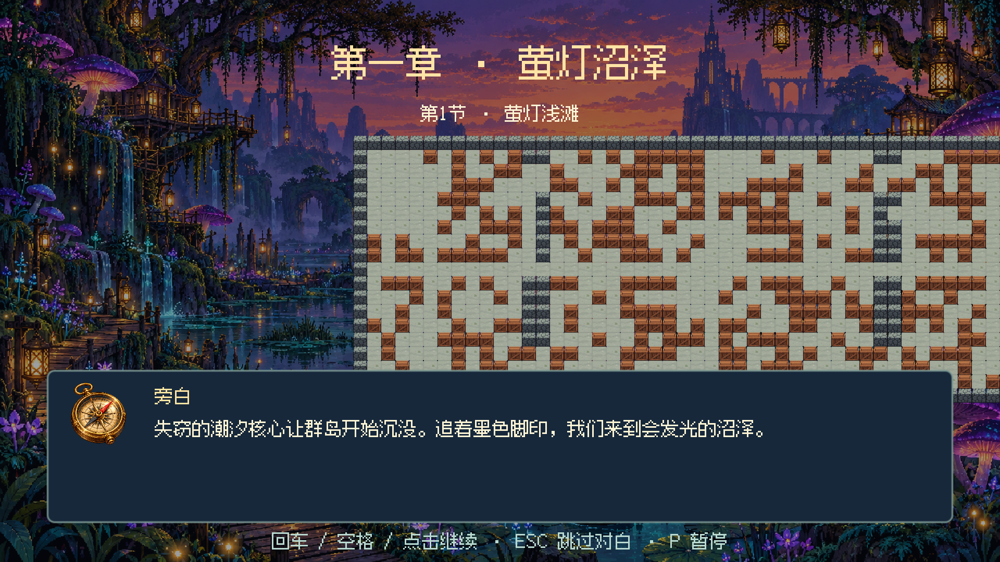</td>
<td width="50%">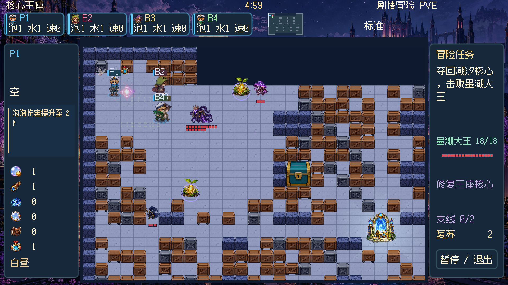</td>
</tr>
<tr><td align="center">旅途从一段中文对白开始</td><td align="center">和伙伴探索大地图、挑战守护者</td></tr>
</table>

## 🎒 成长、坐骑与泡泡

扩容、延伸水柱、跑鞋、骑术成长和 PVE 伤害提升图标右上角有蓝色加号。主动道具占一个手持槽，空手自动拾取；有道具时靠近会显示 E / . / ; / V，按键才交换，旧道具留在地上。成长道具和坐骑蛋直接生效。局内成长每局重置，角色解锁和闯关进度长期保存。

泡泡鸭擅长奔跑，甲壳龟能承受更多伤害，跳跳兔可以跨越箱子。坐骑先替角色承受攻击，骑术成长还能提高速度与耐久。人物之间可以穿行，触碰被困队友仍会救援，触碰被困敌人则将其击败。

泡泡在**爆炸瞬间**结算人物和怪物伤害，范围内已有泡泡立即连爆。随后水柱余波只播放动画，走入余波或在余波中放新泡泡不会受伤或连爆；激光等地图危险按各自规则生效。被困后有八秒救援窗口，也可使用脱困针或护盾脱身。

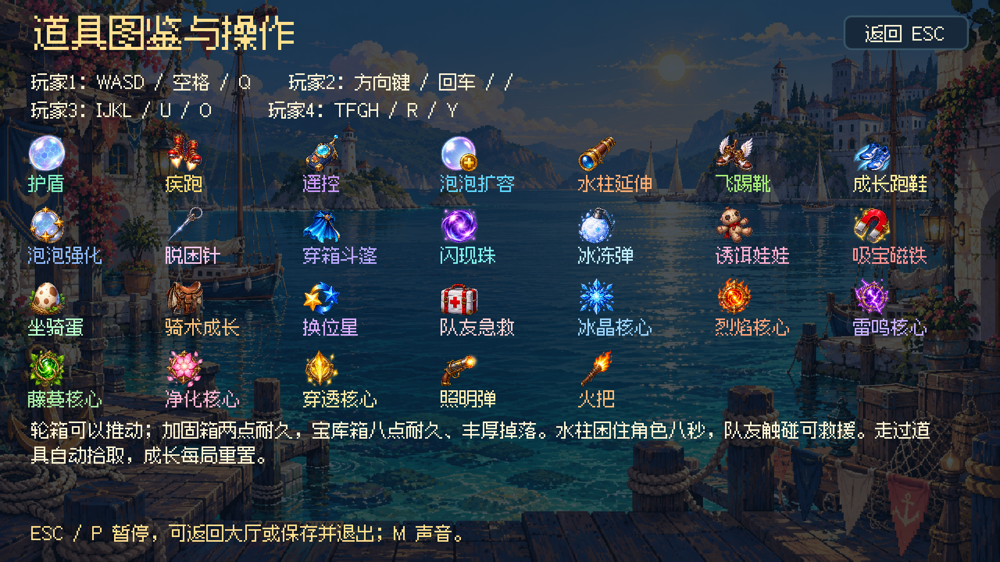

蓝莓、雪球、机仔初始为泡泡 2／水柱 1／速度 0；桃桃、柚子为 1／1／1；薄荷、星芽、火苗为 1／2／0。角色选择支持每局随机。随着闯关解锁更多伙伴，人物选择和席位配置会保留。

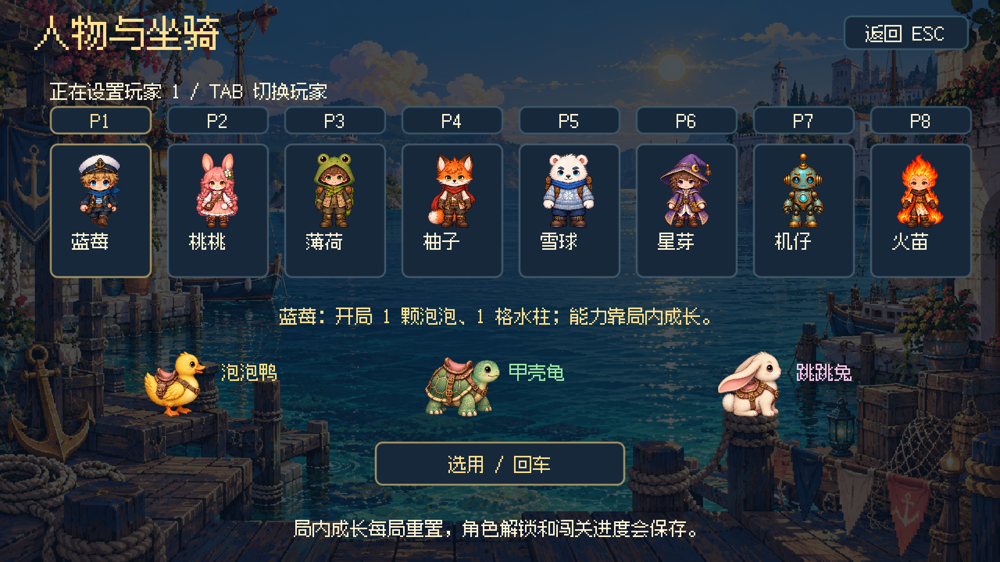

## 📦 箱子也有脾气

普通箱和可推轮箱一击破坏，装甲箱需要两击；**2×2 宝库箱需要八次命中**，同一次爆炸覆盖几格都只扣一点耐久。满血箱体隐藏耐久标记，受损后显示红色方格。

宝库破坏后，空间足够时掉落四至六件奖励，包括坐骑、属性核心和成长道具。爆炸会摧毁范围内已有的掉落，但同次爆炸刚释放的箱内奖励会保留，后续爆炸仍可摧毁。

六种属性核心改变泡泡效果：冰晶冻结、烈焰冲击、雷鸣电弧、藤蔓减速、净化救援、穿透箱体。核心使用原有道具键，充能二十秒，也会改变已经放置的己方泡泡。

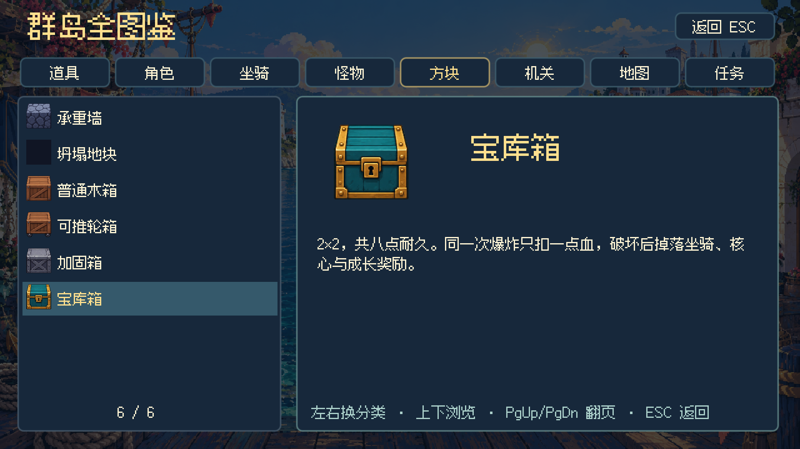

## 🔦 机关、昼夜与最后三十秒

传送、水流、滑冰、弹床、激光、陨星、列车、棱镜、漩涡、浮桥和炮台会改变局势。新版机关使用像素图集，激光有黄色充能警示、红白光束、火花和余辉。

普通地图保持白昼，指定地图才有昼夜或迷雾。四张洞窟地图常年黑夜，每局随机布置六处固定火把。夜里墙与箱子会遮光；照明弹照亮全图八秒，手持火把扩大自身视野二十秒。白昼关闭人物、泡泡与水柱的局部光，真实发光机关仍保留光效。

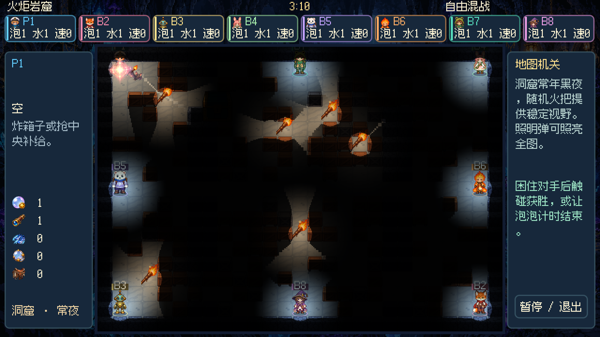

十四个主题各有约两到三分钟的 BGM，覆盖海港、森林、冰雪、沙漠、火山、工厂、糖果、星空、沼泽、遗迹、深海、空港、王城和洞窟。开局 2.5 秒播放准备乐句，最后三十秒切换紧张音乐，计时变红；倒计时归零后，每五秒向内坍塌一圈。

<a id="controls"></a>
## ⌨️ 一起开玩

| 操作 | 控制一 | 控制二 | 控制三 | 控制四 |
| --- | :---: | :---: | :---: | :---: |
| 移动 | WASD | 方向键 | IJKL | TFGH |
| 放泡泡 | 空格 | 回车 | U | R |
| **使用道具** | **Q** | **/** | **O** | **Y** |
| 确认拾取／更换 | E | .（句号） | ;（分号） | V |

键位按真人席位顺序分配，查看席位设置中的控制编号。控制二也支持数字键盘回车和除号。

- **大厅**：键盘或鼠标配置模式、地图、难度和席位，回车开始。
- **C / B / V / F1**：人物、统计、地图图鉴、道具与操作说明。
- **F2 / F3**：完整图鉴／语言选择。
- **TAB / R**：对战大厅顺序换图／随机选图。
- **ESC / P**：暂停，可继续、返回大厅或保存后退出；切出窗口也会暂停。
- **M**：切换声音；**Shift＋道具键**：手动交换脚下主动道具。
- **剧情对白**：回车或空格继续，ESC 跳过，P 暂停。

## 💾 保存你的冒险

自动保存经典与剧情进度、人物解锁、席位与队伍配置、AI 难度、音量、语言、支线奖章和局外统计。中途返回大厅会保留已保存进度，下次从当前关卡重新开始。

macOS 存档位置：

```text
~/Library/Application Support/paopaotang/profile.json
```

其他平台使用 Godot 的 `user://profile.json`。详细规则见 [完整玩法手册](docs/玩法说明.md)。

## 🛠️ 开发与资源制作

```text
.
├── project.godot          # Godot 工程入口
├── scenes/main.tscn       # 主场景
├── scripts/
│   ├── core/             # 共享状态、输入、对局循环与存档
│   ├── gameplay/         # 剧情、泡泡、箱体、机关与天气
│   ├── render/           # 图集、角色配色、遮挡、镜头与照明
│   ├── ui/               # 菜单、大厅、图鉴与国际化
│   └── data/             # 地图、人物、道具与中文剧情
├── assets/               # art 分类美术、audio 分类音频、字体与 shader
├── locales/              # 五语言离线目录
├── tools/                # art、audio、i18n、build、checks；harness 统一入口
├── docs/                 # 开发文档、玩法手册与精选截图
└── licenses/             # 第三方授权声明
```

从 [AGENTS.md](AGENTS.md) 和 [开发文档](docs/README.md) 开始，统一命令见 [harness 使用说明](docs/harness.md)：

```sh
export GODOT_BIN=/Applications/Godot.app/Contents/MacOS/Godot
python3 tools/harness.py doctor
python3 tools/harness.py check
python3 tools/harness.py run
python3 tools/harness.py pack
```

运行已有素材无需重新生成。修改素材前阅读 [资源制作](docs/资源制作.md)；当前 HD 图集的提示词与来源见 [制作记录](docs/art-production/GENERATION.md)。图集原图更新后，用 `python3 tools/art/index_atlases.py` 重建裁切索引。生成器会覆盖对应资源，请按需执行。

本项目使用 `res://` 路径引用，`.uid`、`.import` 和 `.godot/` 均忽略。引擎、安装包、临时截图、日志和检查存档不提交，文件规则见 [文件与资源管理](docs/文件与资源管理.md)。启动检查不代表全部剧情已经逐关通关，验收范围见 [开发与验收](docs/开发与验收.md)。

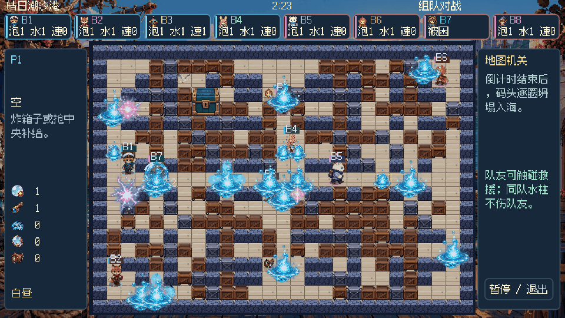

## ✨ 最近更新

| 版本 | 主要变化 |
| --- | --- |
| **v4.7.2** | 人物穿行、回合音乐、泡泡破裂音效、机关重绘、骑乘裁切与鞍位、昼夜灯光、箱体密度和奖励保留 |
| **v4.7.1** | 逐席位配置、爆炸瞬时伤害、激光效果、图集裁切修正、源码分目录 |
| **v4.7.0** | PVE 扩图与镜头、高压核心、方格生命值、统一遮挡、三档 AI |

详细制作和运行记录保存在 [开发与验收](docs/开发与验收.md)。

## 🎨 素材与授权

游戏美术使用内置 imagegen 制作，音乐与音效由本项目制作。中文界面使用圆润手写风格的 [霞鹜文楷屏幕阅读版](https://github.com/lxgw/LxgwWenKai-Screen)，其他语言与缺字回退使用 [Noto Sans CJK](https://github.com/notofonts/noto-cjk)，通过 Godot MSDF 在 1080p 保持清晰。字体与 Godot 授权文件保存在 [licenses](licenses/) 中。

<div align="center">

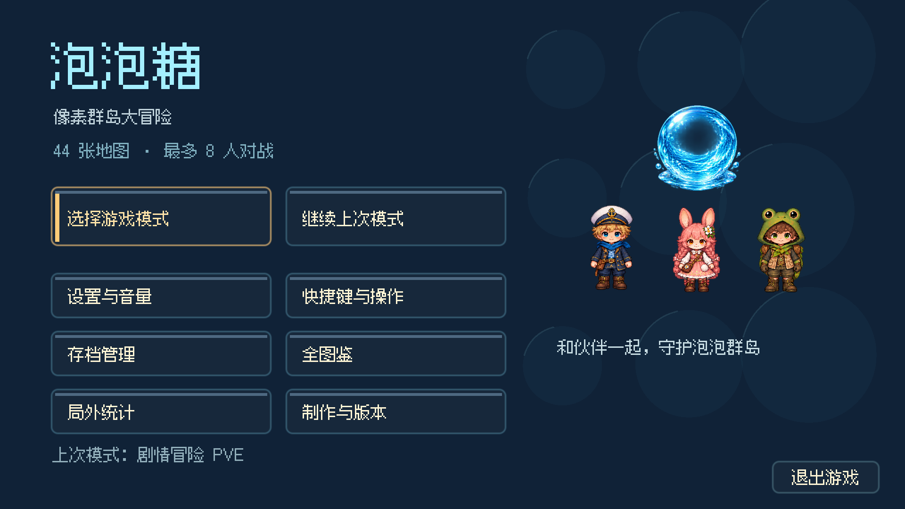

**下一颗泡泡，记得给队友留条路。**

</div>


### v4.7.3：护送到站与统一水柱

护送车以当前地图的实际出口为终点，三个补给站按路线长度重新分布。车辆完成移动、抵达出口后消失，停止继续前行与受伤；玩家走近出口仍按既有流程完成关卡。修复硬编码旧终点导致车辆穿过出口仍继续行驶的问题，护送进度同步实际路线长度，五语言同步。

水柱直段、末端、中心水花与出现／展开／回落／消散四个阶段改用同一套透明像素素材，移除粗折线产生的斜方块边缘与混用的旧水花。绿色图形是藤蔓核心留下的四秒减速区域，现在显示为枝叶、根茎和枯叶，不再使用折线与三角占位图。爆炸仍只在瞬间造成伤害，余波不产生伤害。


### v4.7.4：怪物技能动画

毒蕈、水母与飞蜂的远程技能增加孢子、水浪、电弧特效，以及飞向预警落点的动画。五个 Boss 分别使用根脉、砂钟冲击、潮汐、风雷、墨潮特效。施法者身体动作旁显示蓄力和释放效果，地面预警与实际命中使用一致的技能颜色，命中后扩散并消散。技能身份从预警传入命中数据，动态光源同步对应色彩，地图激光与玩家水柱沿用各自绘制路径。

攻击伤害和危险范围保持原规则，完整血量 Boss 预警仍为 1.6 秒，半血后 1.1 秒。修正上一轮护送修改误将车辆终点条件用于怪物移动的问题，车辆到站后怪物仍正常移动。


v4.7.5 重审全部模式的成长、掉落、坐骑、属性攻击、地图资源和 PVE 队伍缩放，详见 [平衡调整](docs/平衡调整-v4.7.5.md)。


v4.7.6 新增 21 首原创配乐，包含十四主题变奏、菜单、大厅和五章首领战专曲，共约 64 分钟。详见 [配乐扩充与试听](docs/配乐扩充-v4.7.6.md)。


v4.7.7：血条统一为单排，最大生命值不超过 10 时每格一点；超过 10 时用十格表示比例，旁边的红心数字显示准确剩余血量。优化描边、高光与空血格对比，适用于怪物、Boss、坐骑、箱体耐久和护送车。


v4.7.8：修复走路动画每帧缩放与贴墙朝向、连续放泡后卡住的问题。新增蝙蝠、海鸟、蝴蝶、蜻蜓和游鱼动作帧，各主题环境动画改为独立设计。44 张地图加入地面分区与空场掩体，Boss 房保留中央躲避路线；洞窟固定照明换成落地灯柱。对战大厅新增高级规则（快捷键 A），支持自选坍塌时间、速度、昼夜、雾气、箱子密度、掉落量和地图机关，洞窟恒夜。血条底色改为半透明。详见 [画面与规则更新](docs/画面与规则更新-v4.7.8.md)。


v4.7.9：中文换用霞鹜文楷手写字体，其他语言使用 Noto Sans CJK；主动道具空手自动拾取，手持时按提示键更换；移除泡泡强化；五类成长道具增加蓝色加号。详见 [字体与拾取更新](docs/字体与拾取更新-v4.7.9.md)。

每局结算展示所有真人与 Bot 的击杀、救援数，PVE 另列怪物击败数。地图增加永久掩体组合；对战 Bot 先避险，结合安全路径距离优先击杀；队友明显更近时先救援。


v4.8.0：新增大力丸与邪魔面具、成长道具死亡掉落；传送带允许逆行，漩涡局部间歇吸引。完善图鉴分类与关卡预览、角色初始三维、跳箱与推箱动作，以及回合结束演出和结算配乐。新增主题藏身灌木、双向管道与空心树干、四门小屋和帐篷。详见 [玩法与结算更新](docs/玩法与结算更新-v4.8.0.md)。
