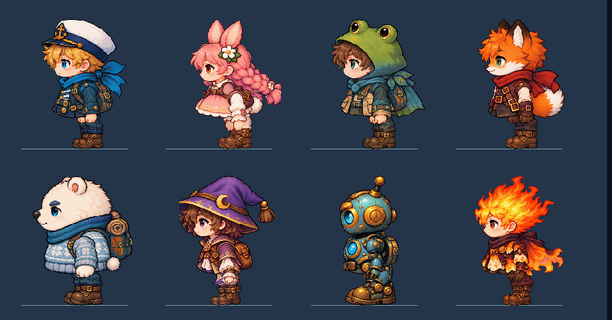

# 侧身摆臂 v5.0.1

旧侧身帧的手臂姿势缺少连续变化，调整帧序仍会突跳。本版为八名角色制作独立的手臂、腿部和无臂躯干素材，左右行走改为连续的肩部、髋部摆动。近侧手臂和近侧腿反向交替，远侧肢体采用相反相位。头部和身体保持固定，摆幅随起步、停步渐变；向右时围绕固定画布镜像，不改变角色位置。

动作仍由实际移动距离驱动。所有玩法共用同一入口，坐骑、赛车及受击、困泡等特殊动作继续使用各自素材。图片由内置 imagegen 生成并保留原始像素；`tools/art/index_side_rigs.py` 只读取透明边界、头部锚点和相邻碎片的排除区域。

验收使用独立临时存档和真实 Godot 渲染，检查八角色左右循环、起步与停步，以及实际地图中的位置与显示。过程画面和日志位于 `/tmp/paopaotang-v501-*`。启动检查只代表资源导入与主场景可加载，不代表所有关卡完整通关。
