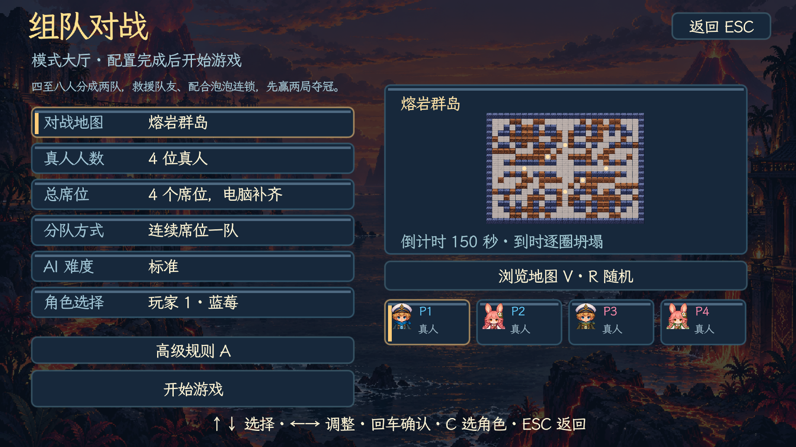
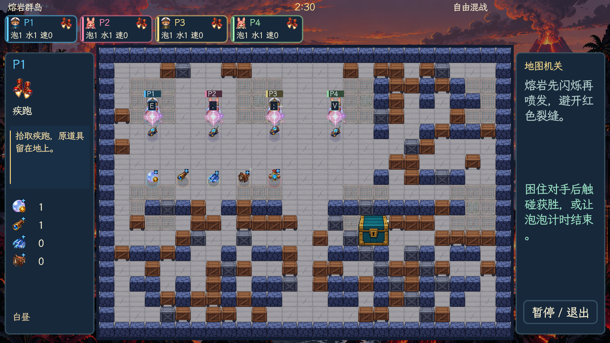
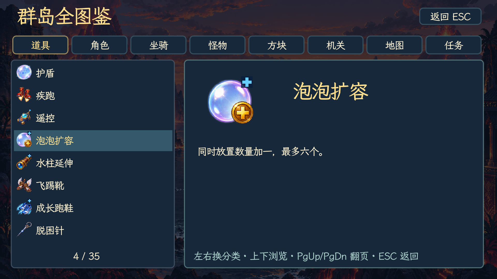
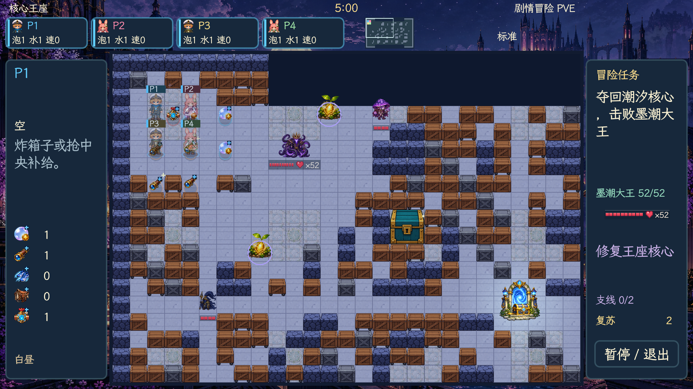
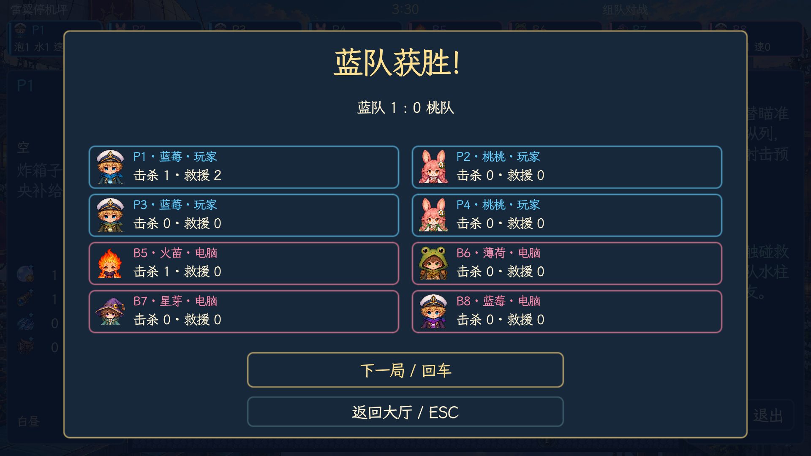

# 字体与拾取更新 v4.7.9

中文采用 [霞鹜文楷屏幕阅读版](https://github.com/lxgw/LxgwWenKai-Screen)，以手写笔形配合童话冒险画面。英文、日文、法文、德文及中文缺字回退使用 [Noto Sans CJK](https://github.com/notofonts/noto-cjk)。使用 [Godot MSDF 字体绘制](https://docs.godotengine.org/en/4.5/classes/class_fontfile.html)，在 1080p 下保持平滑，字号不再被取整成三档。两款字体原文件和 OFL 授权一起交付。

删除大厅重复的电脑补位文字，重新核对角色行、高级规则和开始按钮之间的间距。

主动道具仍只有一个手持槽。空手走到道具上自动拾取；已有道具时，靠近地上的主动道具会显示拾取键，确认后更换，旧道具留在地上。四套控制的拾取键如下，原来的使用键保持不变。

| 控制编号 | 确认拾取／更换 | 使用道具 |
| --- | --- | --- |
| 1 | E | Q |
| 2 | .（句号） | / |
| 3 | ;（分号） | O |
| 4 | V | Y |

仍支持 Shift＋使用键确认更换。倒计时、暂停、被困和死亡期间不能确认拾取；墙和箱体会阻挡隔物取物。成长道具继续自动生效。

扩容、水柱范围、移动速度、骑乘成长与 PVE 伤害提升统一在图标右上角增加蓝色加号，地图、侧栏、帮助页和图鉴一起更新。泡泡强化已移除，退出掉落池、宝库和怪物奖励、图鉴与属性显示。保留原编号空位，其他道具的编号不变。

验收覆盖五语言大厅、帮助、现有文本字符覆盖，以及四套真实按键的自动拾取、持有保护、确认更换和旧道具保留。随机掉落抽取 2000 次没有泡泡强化，图鉴中也无该道具入口。

地图同时增加成组的不可破坏石柱、短墙，沿用各主题已有的墙体素材。对战布置成镜像；出生点、中央通道、地图机关、剧情任务点与护送路线保留。每组放置后检查周围通路连通性，无法绕行就撤销该组。四十四张对战图的出生点和二十节 PVE 的主／支线任务点均做了实际地图生成与通路检查。

每局结算改为最多八席的成绩卡，显示各席位的角色、真人／Bot、击杀数与救援数；PVE 另外显示击败怪物数。接触击杀记给触碰的敌人，被困计时结束记给困住角色的泡泡拥有者；坍塌与怪物击杀不算给玩家。触碰、救援道具和净化泡泡都按实际救出的队友计数，排除自救和重复击杀；救出剧情居民也计救援。每局重新清零，跨局比分照常保留。

对战 Bot 在自身避险后优先接近被困队友，优先级高于敌人、诱饵和成长掉落；救援期间暂停主动放泡，救援道具仍可使用。怪物接触被困玩家直接击破囚禁泡泡，沿用正常死亡动画与音效。

实机验收检查了触碰击杀、救援、自救排除、重复死亡计数、被困超时归属、Bot 救援优先和停止放泡、PVE 怪物归属及下一局计数清零。五种语言的结算页面均实际绘制。
