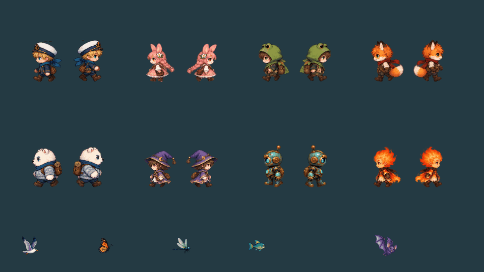
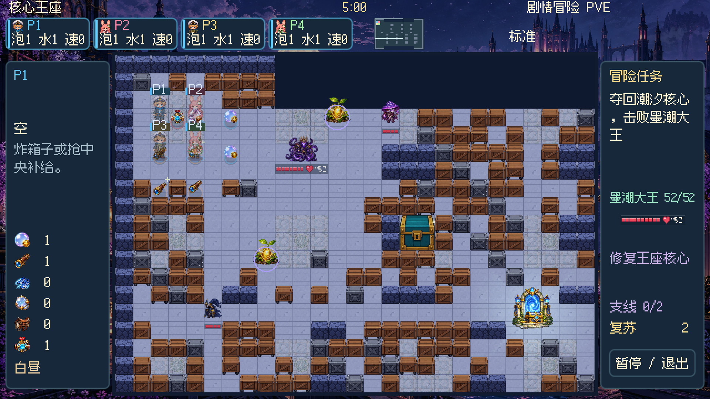
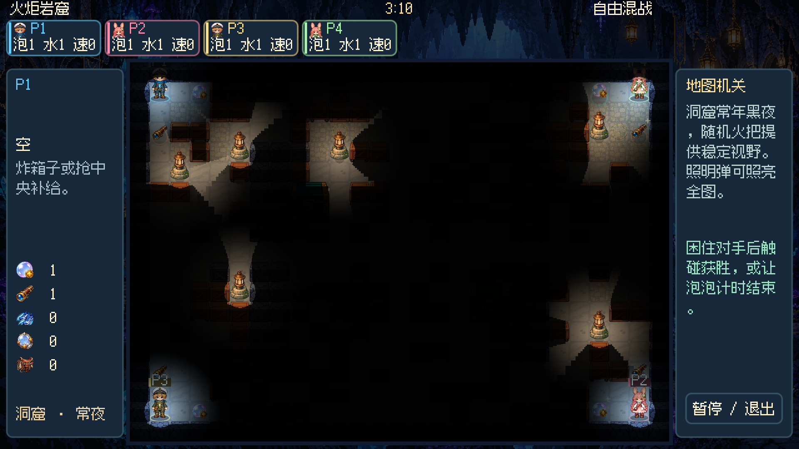
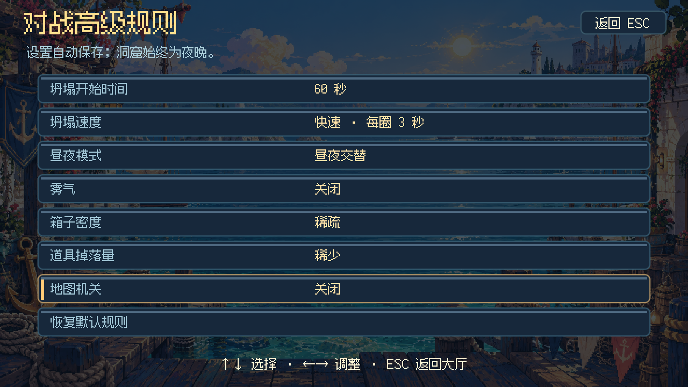

# 画面与规则更新 v4.7.8

人物左右移动的问题来自资源目录整理后仍检查旧路径前缀：每帧被单独缩放，身体随动作变化大小。现在按整套动画的最大帧固定比例绘制，脚底对齐；贴墙滑动按实际位移选择朝向。继续使用完整人物帧，避免拆开四肢旋转。停止时显示原有站姿。

地图升级覆盖 44 张地图：按主题加入石铺、木板、金属格栅、浅色镶嵌和地面标记，较大的空房补充成组箱体与边缘掩体。保护出生区、任务路线、护送通道和 Boss 中央躲避空间。固定灯光改为有石基的灯柱，沿用地面深度排序，不再把手持火把当作悬空路灯。

环境动画按主题设计：港口海鸟、森林蝴蝶、沼泽蜻蜓、珊瑚礁游鱼、洞窟振翅与滴水；工厂蒸汽、沙漠风沙、火山余烬、糖果气泡和星空流星分别绘制。飞行动物用固定比例的完整动作帧，不再拉伸静态图片模拟振翅。装饰不增加碰撞和伤害。

对战大厅按 **A** 或点击“高级规则”，可选择坍塌开始时间、坍塌速度、昼夜模式、雾气、箱子密度、道具掉落量和地图机关。规则自动保存；“恢复默认规则”仅重置这七项。洞窟恒夜，不允许改为白昼。PVE 与经典闯关沿用自身规则。

同时修复连续放泡、转向时的离开权限覆盖，以及席位设置页仅悬停就改变控制方式或打开角色页的问题。生命与耐久格保留单排红色，底板和空格改成半透明。

验收包括真实 Godot 场景启动、44 图与 20 个 PVE 场景、出生点与任务目标连通性、护送通道、双泡离开与转向、七项设置存档、洞窟恒夜以及五种语言高级页面。动画逐帧截图用于查看尺度与裁切。连通性检查按箱体可被炸开计算，不代表已人工通关全部关卡。
