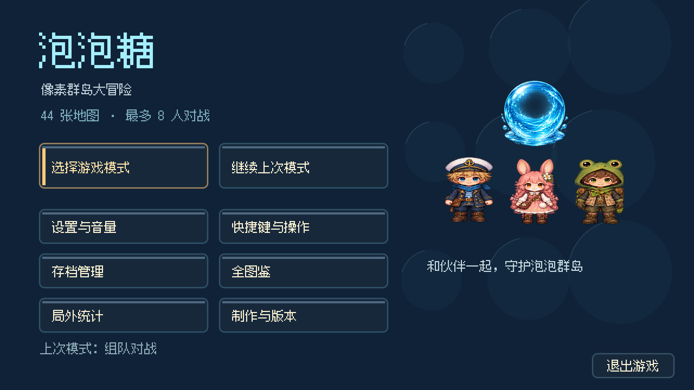
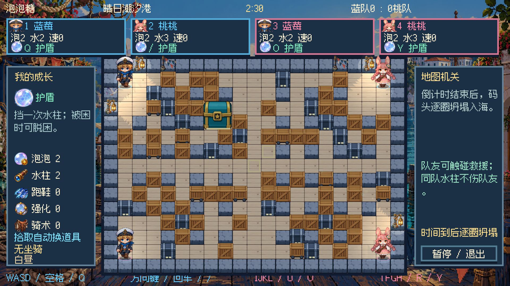
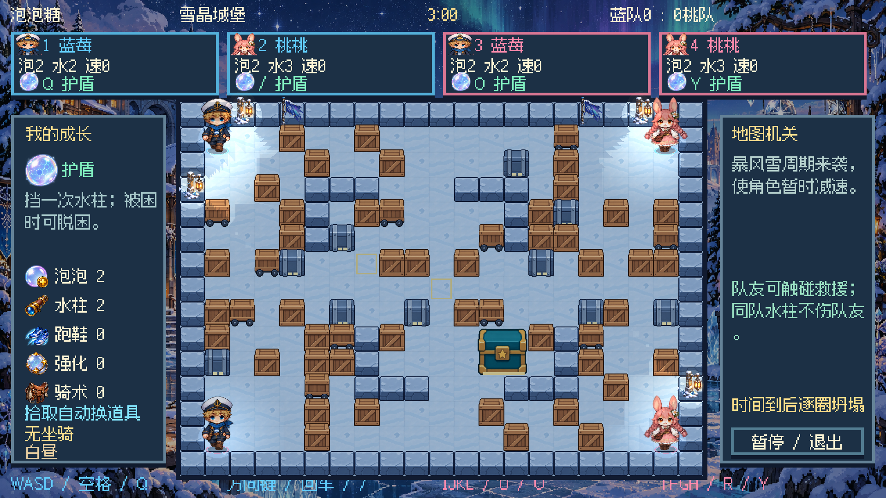
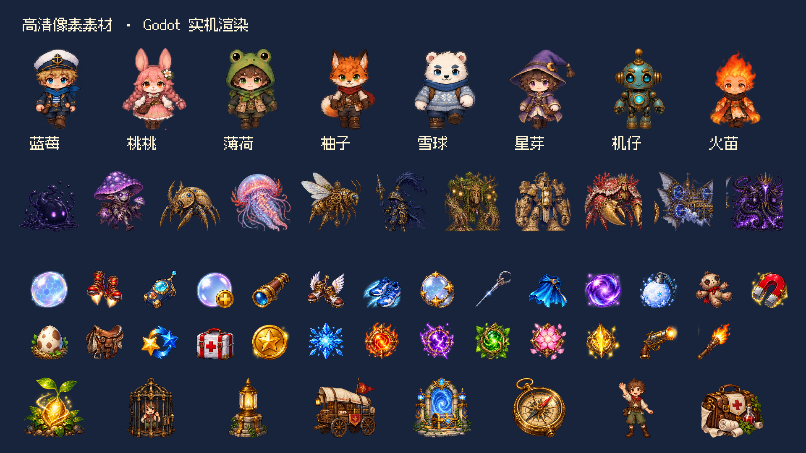
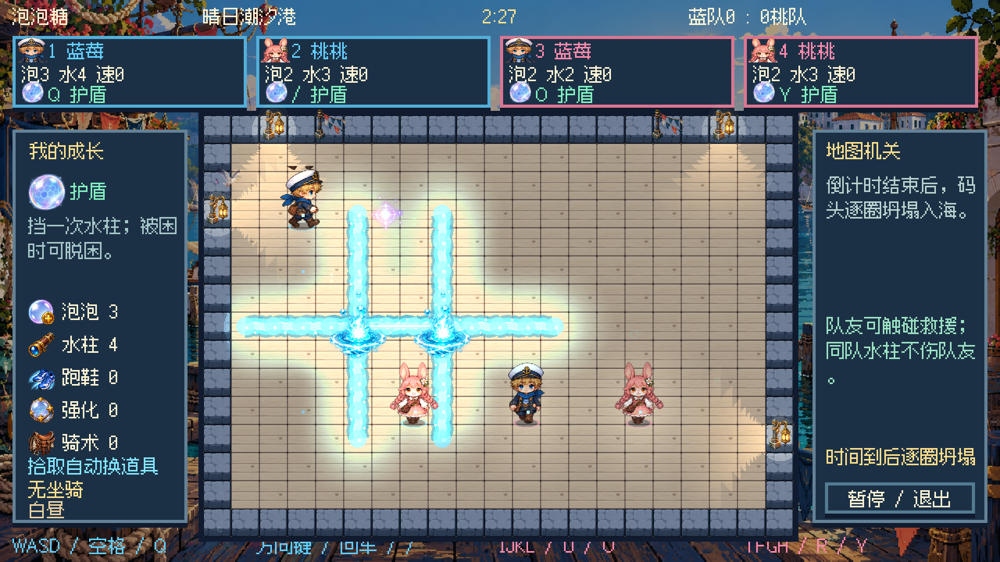
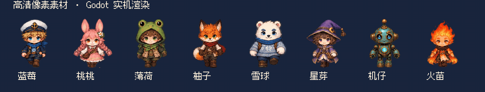
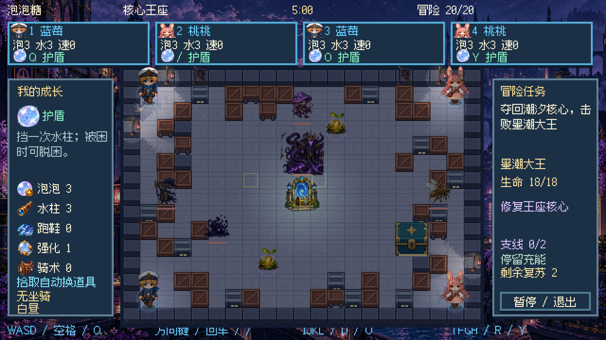

v4.6 怪物动画补充：原先只对静态怪物贴图做整体起伏和受击倾斜，本轮换为十一张独立动作图集。每种怪物含六帧待机、六帧右行、六帧左行、六帧攻击、六帧受击、六帧倒地，共 396 帧。绘制使用一致的缩放基准和脚底锚点；停止移动回到待机，攻击帧按实际蓄力倒计时播放。阵亡动作播完后保留倒地姿势，三秒后停止绘制。

v4.5 补充：地图从 315 格扩大到 513 格。角色约一格半高，闲置使用对应方向的站姿，移动才读取连续行走帧。增加八位角色的四帧困泡、三阶段倒地，以及六阶段破泡和六阶段救援开泡图集。十六类地面机关统一为精细正交素材，移除边界墙上的旧灯笼、旗帜与无实体光源。主菜单使用安静底色和清晰入口；对局顶部容纳八人信息，底部快捷键文字删除。

# 移动与美术升级

v4.4 保持 1920×1080、本机四人和原有格子判定。这轮把地图、怪物、道具、泡泡、坐骑与任务物件接入同一套精细像素素材，并为八位人物补充独立行走帧。

| 画面与手感问题 | 已执行的改动 |
| --- | --- |
| 地面、墙和箱子细节密度接近，混用斜角素材难辨通道 | 重新制作十四套正交地图素材；地面降低纹理对比，墙与箱体保持水平、垂直边缘，移除通道装饰并减少环境粒子 |
| 地图和道具细节落后于人物 | 十四主题分别重绘地表、墙、普通箱、推动箱、装甲箱、宝库及装饰，四十四张地图使用对应主题 |
| 方块材质重复、类型难辨认 | 推动箱带轮组，装甲箱带金属包边；宝库保留两格占地与完整、受损造型 |
| 怪物与任务物件像占位图 | 重绘十一种怪物与 Boss、八种任务物件，统一深色轮廓、暖色金属和发光材质 |
| 道具尺寸小、造型粗略 | 重绘二十七种有形道具，护盾、跑鞋、针、核心和照明物件都有独立形状 |
| 行走主要由静态人物分层变形 | 改为整张独立人物帧，避免切分肢体产生裂缝；每方向十二至十四帧，共四百零八帧 |
| 动作切换欠缺身体表现 | 正面新增四帧放置和三帧受击，共五十六帧；其他朝向保留整体受击倾斜与闪光，困泡保留挣扎反馈 |
| 起步和停止太生硬 | 首步使用渐进曲线，持续移动短暂加速；转向降低动量，松键后画面在当前格内收势 |
| 水柱像重复十字方块 | 按实际爆炸连接方向绘制连续水流，加入水芯、泡沫、流动水滴、扩散环和元素表现 |
| 圆泡泡、坐骑与人物风格不一 | 七种元素泡泡、透明困泡和三种坐骑四方向重新制作；骑手保留鞍座与脚位对齐 |
| 软件图标粗糙 | 重绘圆形水泡、珊瑚星和环绕水花，生成 macOS 图标尺寸与应用图标 |

行走帧数按原图实际布局读取。蓝莓、薄荷、雪球、星芽每方向十三帧，桃桃、机仔、火苗十二帧，柚子十四帧。全部行走帧采用一致裁切尺寸与脚底锚点，播放进度跟随角色移动。坐骑目前使用四方向完整造型与整体起伏，怪物使用整体移动、轻微摇摆、受击倾斜和闪光。

轻微惯性只改变移动过程和格内视觉收势。松键不会多走一格，撞墙仍停在原格；移动、拾取、传送、命中与 Bot 避险继续使用逻辑坐标。水柱画面沿实际爆炸格连接，连环爆炸和伤害规则沿用原有实现。

新素材保存在 `assets/art/`。图集由内置 imagegen 重新生成，原始 PNG 未进行像素修改或放大；区域索引只分析透明轮廓。地图使用新正交图集，旧斜角主题图集不再绘制到边界墙上。道具图集为 1659×948，怪物图集为 1448×1086，行走图集均为 2172×724。背景为 1672×940 或 1672×941，运行时适配 1080p 画布。制作说明见 [HD 素材记录](art-production/GENERATION.md)。

验收使用真实 Godot 窗口和隔离存档：逐张绘制四十四张地图，检查二十节剧情的居民、车辆、Boss 和任务对象；输入检查覆盖起步、松键、撞墙、转向、冰面连续滑行、成长拾取与即时连爆。四种模式大厅、暂停退出、鼠标设置、五语言入口、旧存档读取和备份恢复也完成实机检查。渲染检查不等于逐关通关，剧情规则沿用此前版本。

这轮曾先接入细节密集的斜角地图素材，实机中地面和障碍缺少层次。根据画面反馈重新制作正交素材，保留人物细节，把主要战斗区域的辨识放在装饰之前。

文稿核对：素材数量、动画布局、原图尺寸和检查范围已与实现及实机记录对应；已检查编号标题、反转句式、空泛措辞、半角标点和破折号。

v4.6：自由移动与尺寸修正

角色可以斜向移动、随时转向，松键停在格子内任意位置，保留短促加速与制动。脚底碰撞体与墙箱、泡泡及其他角色交互，泡泡仍就近放在格子上，触碰救援与击杀保持即时生效。

地图道具缩至 12×12 逻辑像素，保留原图纵横比；HUD 为 13×13、背包为 22×22，不再让拾取物跨越一格。人物菜单整帧改为等比例显示，正面图集重新排列为 4×2，扩大透明间隔；脚底与阴影统一锚点，站立去掉整体上下浮动。八席位各有服装主题色，五官与主要造型保留，HUD 和局内编号显示个人颜色，组队地面环保持队伍颜色。

实机配图：[道具](screenshots/v46-items.png)、[主题色](screenshots/v46-player-palettes.png)、[菜单](screenshots/v46-menu.png)、[怪物动画](screenshots/v46-monster-animation.gif)。
