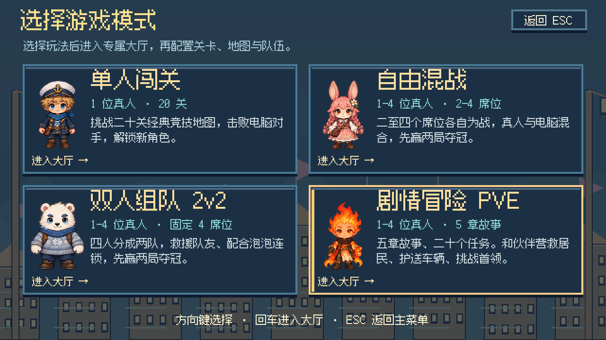
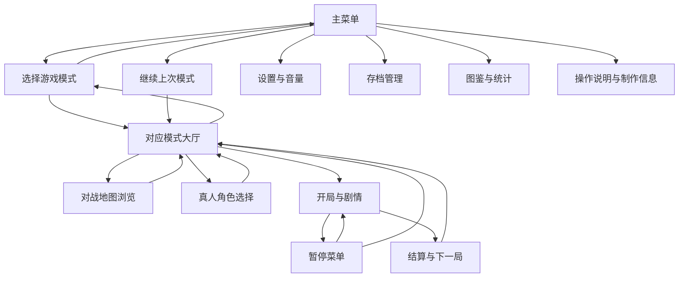
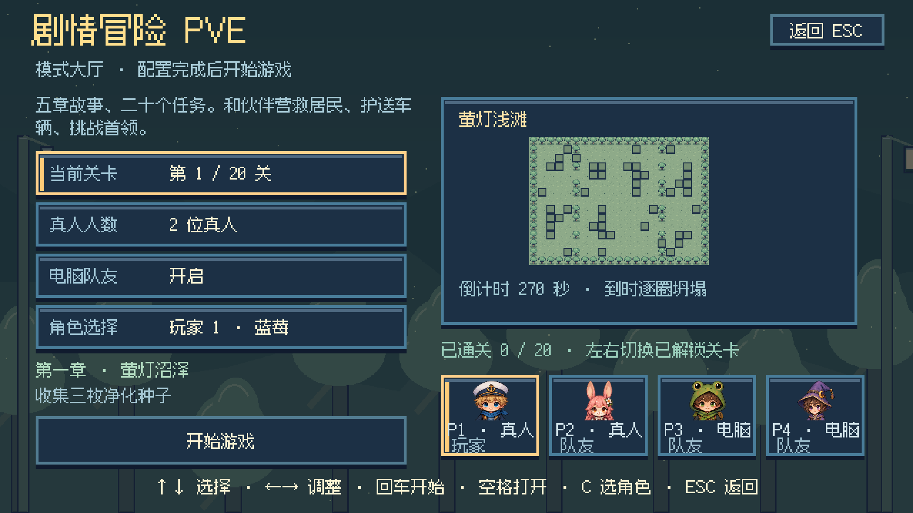
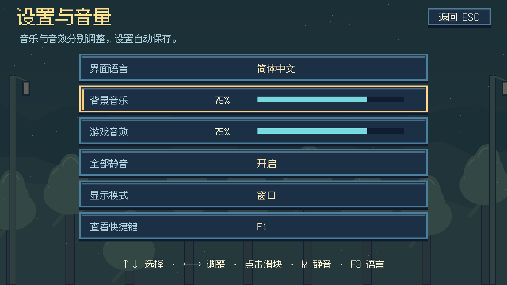
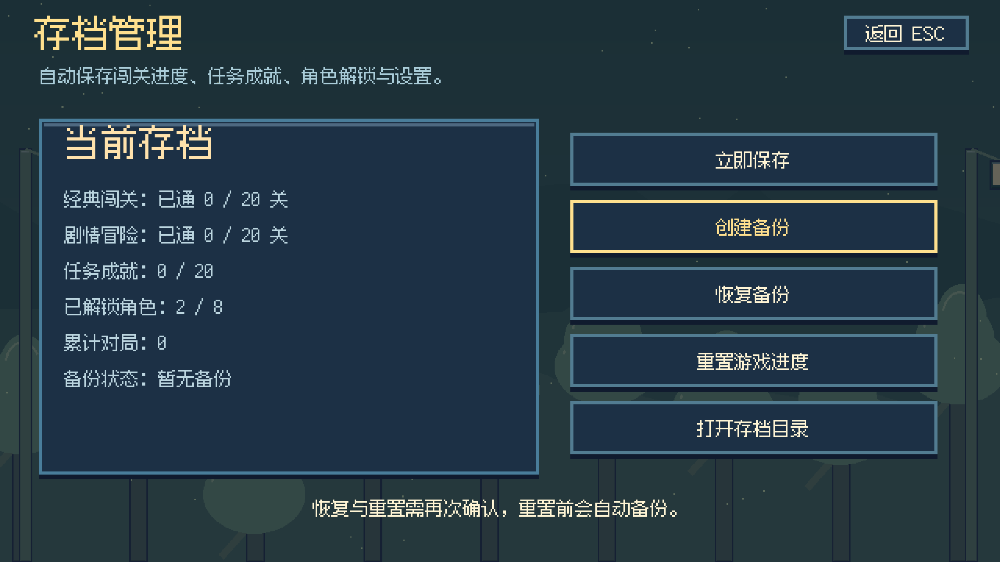
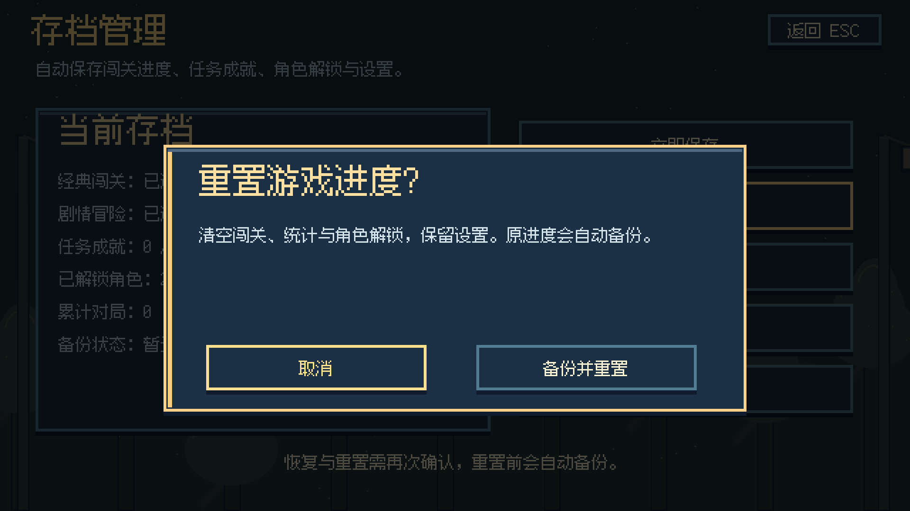

# 菜单与大厅设计

v4.3 已将入口改为“主菜单 → 选择模式 → 模式大厅 → 游戏”。主菜单提供“继续上次模式”，可直接回到上次配置的大厅。它保留模式与设置，不恢复中途退出的对局。

## 先选玩法，再配置这一局

四种玩法的配置不同。将它们放在一张设置表里，会出现不适用的选项，也容易在选地图时切换模式。现在先通过模式卡片了解玩法，再进入对应大厅。

| 模式 | 真人与电脑 | 大厅可以设置 | 关卡与获胜方式 |
| --- | --- | --- | --- |
| 单人闯关 | 一位真人；前四关共两人，第五关起共四人，可开启电脑队友 | 已解锁关卡、电脑队友、玩家角色 | 二十关经典竞技地图，击败电脑对手，保存关卡进度 |
| 自由混战 | 一至四位真人，总席位二至四，其余由电脑补齐 | 指定或随机地图、真人人数、总席位、真人角色 | 各自为战，先赢两局夺冠 |
| 双人组队 2v2 | 固定四席，一至四位真人，电脑补齐 | 指定或随机地图、真人人数、前两人同队或交叉分组、真人角色 | 两队对抗，队友可救援，先赢两局夺冠 |
| 剧情冒险 PVE | 一至四位真人；开启电脑队友时补满四人，关闭时只保留真人 | 已解锁任务、真人人数、电脑队友、真人角色 | 五章二十个任务，完成主目标并进入出口，保存剧情进度与成就 |

“角色选择”配置真人席位。电脑角色仍按关卡或地图分配，大厅头像显示当前预览的电脑造型；随机地图的实际电脑造型会在开局确定。空席也会显示明确标记。

单人闯关和剧情冒险只允许选择已解锁关卡。混战与组队可从四十四张地图中选择，或保持随机，每局重新抽图。在闯关大厅按选图快捷键不会切换到其他模式。

## 主菜单集中提供通用入口

| 入口 | 用途 |
| --- | --- |
| 选择游戏模式 | 查看四种玩法并进入大厅 |
| 继续上次模式 | 直接进入上次配置的大厅 |
| 设置与音量 | 五种语言、独立音乐与音效音量、全部静音、窗口与全屏切换 |
| 快捷键与操作 | 查看四套键位、道具使用与暂停退出说明 |
| 存档管理 | 查看进度、成就与解锁情况，立即保存、创建备份、恢复、重置、打开存档目录 |
| 全图鉴 | 查看道具、人物、坐骑、怪物、方块、机关、地图与任务 |
| 局外统计 | 查看对局、胜负、道具、救援、出局与剧情战斗记录 |
| 制作与版本 | 查看玩法概况、美术来源、语言支持与版本 |
| 退出游戏 | 保存后关闭程序 |

设置和存档各自使用独立页面。地图浏览与人物选择由大厅打开，选完后回到该大厅；图鉴与语言页面回到打开它们之前的界面。无需额外增加大厅下的多层设置菜单。

## 大厅只显示当前玩法需要的选项

大厅左侧配置当前对局，右侧显示地图、倒计时与四个席位。剧情大厅补充章节名和任务目标，经典闯关补充电脑队友的开放条件，对战大厅显示电脑补位人数。

方向键上下选择设置、左右调整，回车直接开局。空格打开当前选项；C 打开人物选择，混战与组队大厅使用 V 浏览地图、R 设为随机。人物页面通过 TAB 或席位按钮切换真人玩家。

主菜单和模式选择页使用方向键选择、回车进入，也可以点击按钮或卡片。鼠标悬停会高亮当前选项。ESC 从大厅回到模式选择，再回到主菜单；通用页面返回其来源。

局内按 ESC 或 P 暂停，选择继续、返回当前模式大厅、保存并退出。中途离开仍记录退出次数，不丢失已经保存的通关进度。剧情对白中 ESC 用于跳过对白，P 打开暂停菜单。

## 设置即时生效，存档操作有确认

音乐和音效分别提供零至百分之百音量。鼠标点击滑块或左右键调整后立即生效，音效调整会播放拾取音作为试听。M 切换全部静音，再次打开声音时保留各自音量。F3 进入五语言选择。显示模式可在窗口与全屏之间切换，本轮不将显示模式写入存档。

旧存档缺少音量字段时，使用百分之七十五默认值，继续保留原有进度、解锁、语言与设置。

存档仍位于原玩家目录的 `profile.json`。创建备份生成 `profile.json.backup`；恢复前先保留当前文件为 `profile.json.before-restore`，再替换进度与设置。可通过“打开存档目录”查看这些文件。

重置会清空经典与剧情进度、任务成就、统计和角色解锁，保留语言、音量、静音与大厅设置。执行前自动将当前进度写为备份。恢复和重置均打开确认框，默认选中取消；备份损坏或安全备份写入失败时取消操作。

## 本轮验收范围

已完成 Godot 导入与大厅启动检查，并在真实图形窗口注入键盘、鼠标事件，验证四种模式开局、角色与地图选择、随机地图、图鉴、暂停及返回路径。音量保存重载、语言返回、旧字段兼容、备份、默认取消、重置保留设置、恢复和损坏备份拒绝均使用临时存档验证。

新增菜单文字已补齐中文、英文、日文、法文与德文目录，四个翻译目录均覆盖当前全部六百九十三个源字符串，格式占位符一致。另已生成五语言模式、大厅、设置与存档页面的实际渲染，检查长文字排版。本轮没有重新验收全部地图和剧情通关，也没有编写单元测试。

v4.3 的 macOS 应用与 ZIP 已重新构建，导出 PCK 也通过同一套图形窗口输入流程；应用签名检查与 ZIP 完整性检查通过。

临时输入验收脚本和日志放在 `/tmp/paopaotang-*`，文档只保留上述六张交付配图。真实玩家存档未改动。
