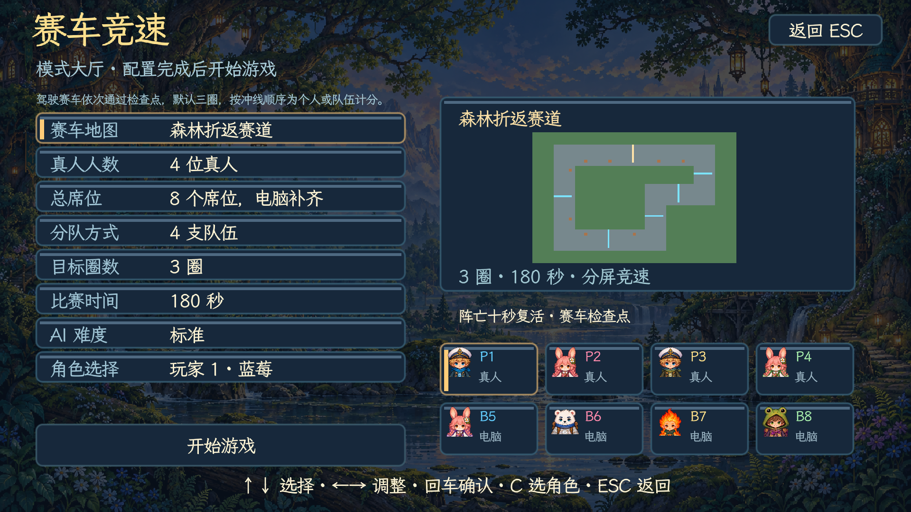
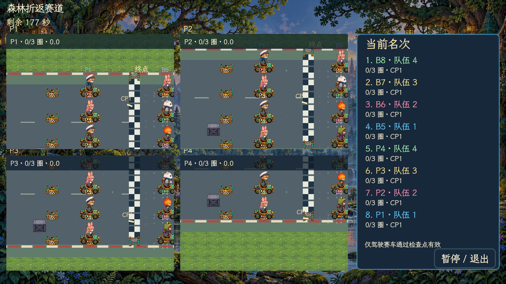
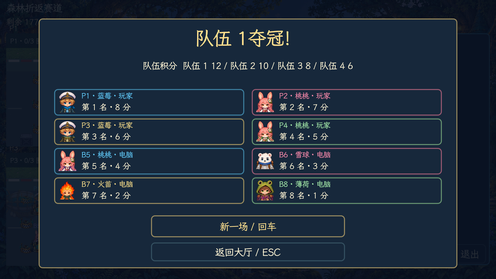

# v4.9.0 赛车与多队伍

自由混战并入组队对战。对战和赛车支持二至八个席位、二至八队，最多四名真人，其余为 Bot。队伍人数可不等，每人一队即混战。每个席位可独立选择角色、控制方式和队伍。旧自由混战存档会迁移为每人一队，不影响角色与剧情进度。

赛车使用独立模式，含三张 67×43 格赛道：海港环岛、森林折返、工厂双弯。默认三圈、180 秒；圈数可设一至九，时间可设 60 至 600 秒。真人使用独立分屏，右侧为实时排名，分屏内标注圈数、速度和下一检查点方向。

必须驾驶赛车按顺序通过检查点，步行、逆向跨线或漏过检查点均不计入。完成目标圈数按冲线顺序获得八至一分，队伍总分为成员得分之和。时间到后进入收尾阶段，仍需按顺序经过剩余检查点，到下一次通过终点时完赛。收尾最长六十秒，未完赛者零分，最高分相同则平局。

赛车由低速起步逐步加速，正常最高约九格每秒。松开方向后会滑行减速，转向保留速度方向与惯性，急转会降低目标速度。驾驶者仍会被普通泡泡困住；死亡十秒后在最近通过的检查点附近安全处复活，保留圈数与检查点进度，清除赛车并给予短暂保护。

赛道起跑位和拐角有赛车补给点，每十八秒检查补货；箱子奖励池有 45% 概率产生赛车。三张图保留多条可通行车道与路侧箱子，Bot 会寻找赛车、绕赛道角点、依次通过检查点，并避开危险。

所有玩法都有随机飞艇空投。飞艇飞向选中的空地，落下的补给经过 1.5 秒降落后成为可拾取物。赛车模式只投赛车，其他模式使用各自普通掉落池；已有物品、泡泡和无法通行的落点不会被覆盖。飞艇不与地面角色发生碰撞，经过人物上方时会淡化，减少遮挡。

美术原图由 imagegen 制作，按原图朝向维护裁切索引，未修改原图像素。赛车绘制空座舱与角色上半身；赛道标线按路段绘制，避免每格都重复整条车道。

验证使用 Godot 4.7.2 原生程序，不新增单元测试：三张赛道各运行一场八 Bot 完整三圈对局，均正常进入结束演出；检查十秒复活、步行不通过检查点、驾驶通过检查点、八队独立出生点与普通地图飞艇投放。实机检查四真人分屏、赛车大厅、图鉴和结算。超时对局核对了下次冲线完赛、个人积分、队伍总分与六十秒收尾上限；不等人数分队和赛车配置可保存、重新读取。旧混战存档即使残留其他模式的队伍设置，也迁移为八人各自一队；验收时保留了经典十二关、剧情七节的既有进度。

最终原生导入与启动检查通过（`/tmp/paopaotang-harness-2hs1_448`），macOS 打包通过（`/tmp/paopaotang-harness-c05w9rvz`）。打包后的应用在空项目目录加载自身 PCK，检查了大厅、四人分屏、图鉴、结束演出、结算，以及一场超时对局；未出现脚本或资源加载错误。签名检查与 ZIP 完整性检查通过。导出保留文本场景，避免生成脚本 UID 回退警告。

完整三圈对局记录在 `/tmp/paopaotang-racing-courses-final.stdout`，打包版本记录在 `/tmp/paopaotang-v490-package-final.stdout` 和 `/tmp/paopaotang-v490-package-overtime.stdout`。截图用于核对布局，结算截图使用人为设置的名次，不作为完整比赛通过的证据。检查未覆盖所有普通地图、PVE 关卡与四人长时间连续操作；本游戏仍为本机共用键盘。

