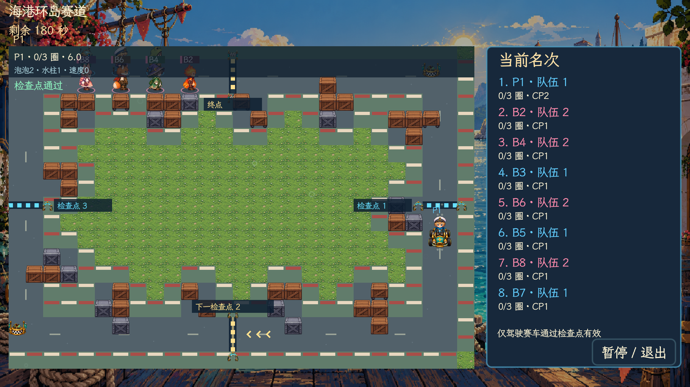

# v4.9.2 两格赛道、检查点与赛车 AI

三张赛车地图从 35×25 缩为 28×19 格。主车道宽两格，外围只留一格边界，取消大起跑广场，八个席位沿两行排列。路侧补给区改为小箱堆，三图分别保留 43、41、42 格可破坏箱子；开局仍需炸箱成长、获取赛车。固定供车点、飞艇、圈数与积分规则沿用上一版。

检查点改为横跨跑道的明亮条纹，附带「检查点」编号。下一检查点使用金色闪动标线和流动箭头，终点使用独立金色标记；通过后显示短提示并播放音效。名称放到路侧，避免盖住驾驶中的角色。目标在镜头外时才显示方向提示，方向从玩家实际位置计算；各分屏分别读取自己的目标，即使同队也不会共用进度。

同时修正了原标线与实际计数线错开半格的问题，大厅预览与图鉴同步对齐。计数仍要求驾驶、顺向、依次通过，宽度与两格赛道一致；横穿时按移动轨迹与计数线的交点判断。

AI 徒步时优先避险、取可达赛车，也会寻找成长道具和炸箱位置；驾驶后缩短决策间隔。弯口使用分阶段目标，确认转过弯后不再被格心对齐拉回上一阶段，修复森林折返弯口来回摆动。漏过检查点会回到入口侧重过，复活后重新规划弯口路线。投泡泡设有间隔，避免连续投弹耽误比赛；普通与困难 AI 可择机干扰前方近距离对手，困难档反应更快、进攻间隔更短。

## 验证记录

使用实际 Godot 场景与游戏循环进行验收，没有新增单元测试。检查存档均位于 `/tmp`，不写玩家存档。

- 三张图在箱子清除后，全部可通行格均可从出生区到达：各图 206/206 格；开局无免费赛车、两处供车点。记录：`/tmp/paopaotang-v492-layout.log`。
- 三图、三档难度共九场八 Bot 完整对局，全部进入结束演出，所有 Bot 均获得名次。最高难度工厂图有两名 Bot 在超时后完成下一圈，符合既有收尾规则，其余均完成三圈。记录：`/tmp/paopaotang-v492-ai.log`。加速模拟关闭音效，避免音频播放实例堆积。
- 单车沿森林折返实跑完成三圈，未在弯口反复摆动。记录：`/tmp/paopaotang-v492-drive2.log`。
- 原生画面中驾驶实际跨过检查点 1 后，目标变为 2，显示通过反馈；核对了单人和四分屏画面。记录：`/tmp/paopaotang-v492-checkpoint-final.log`、`/tmp/paopaotang-v492-visual2.log`。
- 资源、导入与启动检查通过：`/tmp/paopaotang-harness-kvzeec7o`。macOS 打包通过：`/tmp/paopaotang-harness-3eeh5qdx`。安装包在空项目目录加载自身资源后，实际跨检查点并更新目标，未见脚本或资源加载错误；签名和 ZIP 完整性检查通过。记录：`/tmp/paopaotang-v492-package.log`、`/tmp/paopaotang-v492-zip.log`。

本次未重新验收全部普通对战地图与 PVE 关卡，真人操控感受仍需实际游玩反馈。

