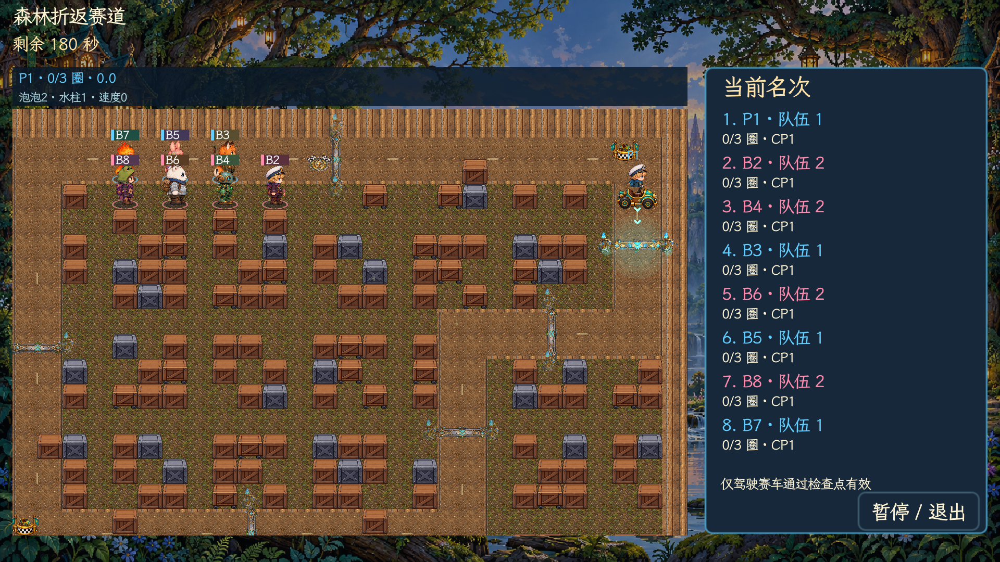
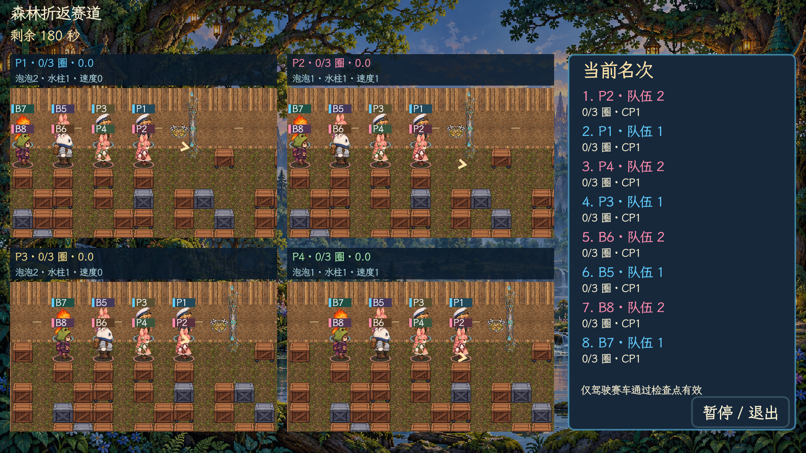

# 赛车美术与音乐 · v4.9.3

赛车图改为两格主跑道与可进入的补给内场。海港、森林、工厂分别使用石板、泥土、金属路面；边缘材质沿跑道四个方向铺设。删除大片不可进入的草地，三图分别放置 128、125、132 格可破坏箱子，箱堆之间保留小路。清除箱子后，每张图的 442 个内场格均可到达。

箱子成功掉落奖励时，赛车在奖励池中的概率由 18% 提高到 35%，三维成长道具占 55%。这不是每个箱子必定有 35% 概率掉车；箱子是否掉落仍按原有规则判定。固定赛车站与飞艇补给继续保留。

检查点用地面符文、晶石灯与流动箭头引导。当前玩家的下一个检查点亮起，经过时短暂闪光，其他检查点保持暗色；终点增加旗帜与月桂图案。移除覆盖赛道的检查点文字牌。

每个分屏的圈数、速度和成长数值移到场景上方的独立栏位。起跑位下移，避免头顶编号被分屏上沿裁切；结束演出的位置也收回地图内。

## 赛车专属音乐

四首均由合成乐器与打击乐原创生成，未使用外部歌曲或采样。

| 曲目 | 使用场景 | 速度 | 循环长度 |
| --- | --- | --- | --- |
| 白帆冲刺 | 海港赛道，马林巴主旋律 | 136 BPM | 112.94 秒 |
| 林间追风 | 森林赛道，长笛主旋律 | 142 BPM | 108.17 秒 |
| 齿轮疾驰 | 工厂赛道，脉冲音色 | 148 BPM | 103.78 秒 |
| 最后冲线 | 最后 30 秒，铜管主旋律 | 164 BPM | 35.12 秒 |

保留起跑倒数提示，比赛开始后进入对应赛道曲；最后 30 秒切换冲线曲，采用现有 0.45 秒淡入淡出。结束演出继续使用胜负音乐。循环边缘增加短淡化，解码后峰值为 0.664–0.764，无削波。

生成脚本：[compose_racing_music.py](../tools/audio/compose_racing_music.py)。完整配乐目录现有 41 首。

## AI 与验证

Bot 在内场获得赛车后，先寻找最近可达的主跑道；驾驶时优先沿跑道前进，遇到危险封路时允许绕行，避免反复钻入补给箱堆。

- 三张地图、三档难度共九场原生引擎模拟，每场八名 Bot 均完成三圈并进入结束演出。
- 地图检查确认尺寸为 28×19，箱子清除后内部 442 格全部连通，各图保留两个固定赛车站。
- 原生画面检查覆盖三种材质、发光检查点、四人分屏和大厅预览；实际驾驶通过检查点后顺序推进并触发闪光。
- 原生音乐加载检查确认三首主题曲均开启循环，最后 30 秒切换冲线曲。
- 项目检查与 macOS 构建通过；从空目录启动安装包，确认包内三种主题素材及四首音乐正常加载。应用签名校验和 ZIP 完整性检查通过，安装包版本为 4.9.3。

上述为临时集成运行检查，未新增单元测试，未修改玩家存档。此轮检查集中在赛车模式，未逐局重跑其他全部玩法；音乐听感与驾驶手感仍需实际游玩反馈。

## 素材来源

地面与检查点图集使用内置 imagegen 生成，原图像素保留，只通过索引选择区域。素材路径与完整提示词见 [制作说明](../assets/art/maps/racing/制作说明-v493.md)。索引工具也保留旧赛车图集的车辆、飞艇裁剪区域，避免全量重建索引后丢失。
