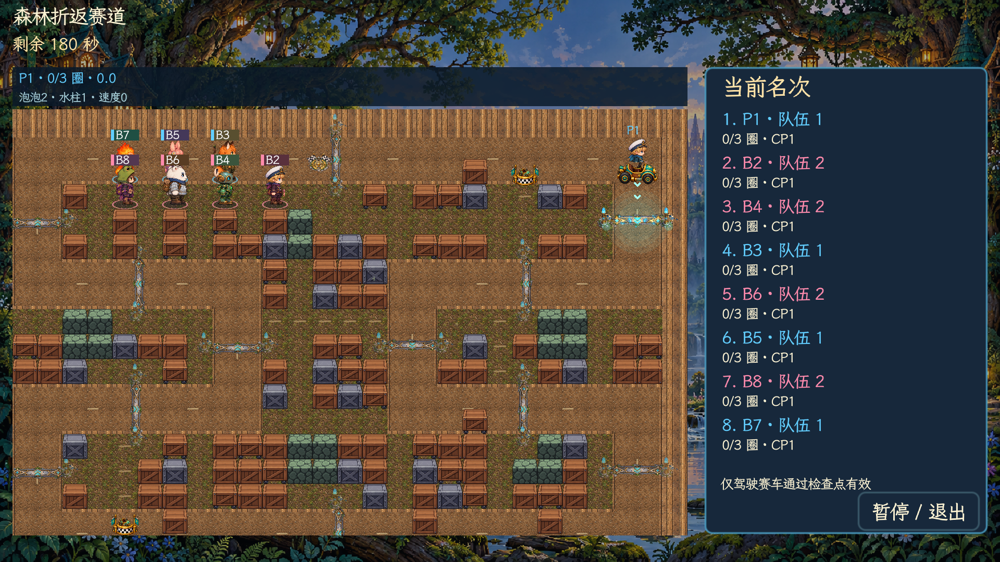

# 赛车路线与驾驶 · v4.9.4

这次针对检查线、内场驾驶和地图路线调整。沿用 v4.9.3 的地面、检查点素材与四首赛车配乐，没有重制其他玩法资源。

检查线的旋转绘制补上与世界相同的震动偏移，避免爆炸时线留在原地。通过检查点后，旧线立即恢复未激活状态，下一条线亮起；保留确认音效，取消旧线延迟发光。

内场赛车原来限速 3.4 格/秒，比基础徒步速度还低，容易误以为无法加速。现在内场和支路基础极速为 5.2 格/秒，主赛道保持 6 格/秒；两者都从静止逐渐加速，保留转向制动与惯性。成长速度加成继续生效。

## 三种路线

| 地图 | 路线设计 | 箱子 | 内部可通行格 |
| --- | --- | --- | --- |
| 海港内湾 | 内凹码头、两侧回折，支路连接上下赛道 | 111 | 425 |
| 森林折返 | 连续左右折返，内场小路连接相邻弯段 | 102 | 425 |
| 工厂交叉 | 上右与下左双环，在中央十字路口交叉 | 145 | 410 |

三图仍为 28×19 格，主跑道保持两格宽。固定掩体分布在补给区与支路旁，炸箱后也不会变成整片空地。步行玩家可沿支路接近赛道阻击，车手可绕进内场躲开水柱，再返回跑道；检查点仍须驾驶赛车按顺序通过，穿过支路不会跳过计圈要求。

每图两个固定领车点都在赛道内侧，周围清出补给湾，外侧保留通过空间。首次供车与补货间隔不变，赛车奖励池权重继续为 35%。

大厅和图鉴预览同步显示新路线与固定掩体。海港与工厂名称同步五种语言。

## 验证

- 原生引擎实际移动：三图内场从静止加速至 5.2 格/秒，主赛道至 6 格/秒。
- 三图共 28 条检查线均按方向推进顺序，全部六个固定领车点均在可通行跑道上。
- 清除箱子后，可通行内部格全部连通：425/425、425/425、410/410；固定掩体继续阻挡人物和水柱。
- 三张图、三档难度共九场八 Bot 对局，每场全部完成三圈并进入结束演出。
- 实机截图比对中，检查线与路面的震动位移一致，为约 `(3, -5)` 屏幕像素；实际过线后旧线熄灭。画面复查覆盖三种路线、四人分屏和大厅预览。
- 项目导入与启动检查、macOS 构建通过；从空目录运行包内场景，三图画面及音乐加载正常。应用签名与 ZIP 完整性校验通过，版本为 4.9.4。

检查脚本和截图原稿位于 `/tmp/paopaotang-v494-*`，未新增单元测试，未修改真实玩家存档。此次验证范围为赛车模式，没有逐局重跑其他所有玩法。
