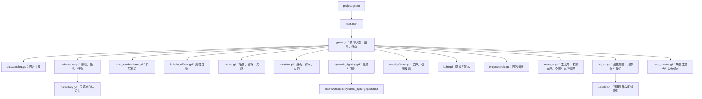

# 项目分析

分析基于当前工作区源码，涵盖昼夜、洞窟、图鉴、国际化和美术系统。当前美术已接入 `assets/hd/` 图集。分析日期为 2026 年 10 月 4 日；下面的计数用于理解当前版本，新增内容时仍应核对数据目录。

## 整体结构

项目是 Godot 4.x 的本机同屏游戏，使用 Compatibility 渲染器，没有外部运行插件。`project.godot` 指向 `main.tscn`，主场景只有一个挂载 `game.gd` 的 `Node2D`。界面和地图主要通过 `_draw()` 绘制，动态照明另有一个 `ColorRect` 子节点与 CanvasItem shader。

逻辑画布为 640×360，主节点缩放三倍，窗口为 1920×1080。地图为 27×19 格，每格逻辑尺寸 16，起点为 `(104, 50)`。高分辨率素材不改变逻辑格子大小。人物、地图、怪物、道具与任务物件使用 HD 透明图集与整帧绘制；早期图集仍保留。角色使用连续移动和小脚底碰撞体，泡泡、机关和伤害仍使用格子规则，没有 CharacterBody 或物理碰撞场景。

协作模块继承 `RefCounted`，持有主游戏的 `g` 引用。主游戏是状态拥有者，也是协作接口。现阶段新增机制应沿用现有方式，不需要先把所有实体改成独立节点或引入通用事件总线。

## 模块职责

| 文件 | 负责的内容 | 修改时的关联 |
| --- | --- | --- |
| `menu_ui.gd` | 主菜单、模式选择、专属大厅、音量与存档管理页面 | 主游戏共享配置、输入、存档与语言 |
| `game.gd` | 加载存档、输入、地图生成、移动、泡泡、水柱、掉落、基础机关、Bot、结算及 UI | 几乎全部玩法模块 |
| `data/catalog.gd` | 44 张地图、14 个主题、道具、人物和坐骑 | 图集索引、图鉴、随机掉落、主题音乐 |
| `adventure.gd` | 主任务、支线、怪物、五种 Boss、护送、复苏和剧情界面 | 主游戏计时、危险列表、存档、对白目录 |
| `data/story.gd` | 五章二十节的任务参数、开场对白和结尾文本 | 剧情关卡顺序与地图对应 |
| `crates.gd` | 单格与 2×2 箱体、推动、耐久、占格索引和奖励 | 网格、爆炸去重、环境伤害和画面 |
| `bubble_effects.gd` | 充能、冰火雷藤净化穿透、怪物受伤和藤蔓区 | 爆炸范围、队伍规则、Bot 预警 |
| `map_mechanisms.gd` | 索引 20 之后的机关与爆炸回声 | `terrain`、`hazards`、泡泡位置与计时 |
| `weather.gd` | 昼夜、周期雾团、固定火把、照明弹状态 | 显示、道具掉落、光源和暂停 |
| `dynamic_lighting.gd` | 读取遮挡格和有效光源，更新 shader 参数 | 40 个光源上限、墙箱遮光、迷雾纹理 |
| `world_effects.gd` | 地面装饰、主题访客、环境粒子、冲击、脚步和连锁光线 | 事件数量限制、主题索引和绘制顺序 |
| `i18n.gd`、`locales/` | 五种语言、完整句子翻译和片段回退 | 格式占位符、文本宽度、存档语言 |
| `encyclopedia.gd` | 从目录构建八类图鉴，补充怪物、方块与机制介绍 | 目录内容与实际规则的一致性 |
| `hd_art.gd` | 加载 HD 图集、透明区域索引和人物、怪物动作帧 | 素材排列、脚底对齐、帧数与绘制比例 |
| `hero_palette.gd` | 用独立小视口和 shader 渲染人物主题色、缓存头像 | 人物 ID、配色、纹理与绘制尺寸 |
| `tools/` | 原创素材、音频、翻译维护、macOS 打包与 harness | 生成顺序、覆盖范围与可选依赖 |

## 对局生命周期

`_ready()` 初始化协作模块、读取存档、准备主题背景和音频，生成大厅地图预览。`start_match()` 清空局比分，再由 `new_round()` 选择地图、重建状态、生成玩家并配置队伍。剧情模式还会调用 `adventure.setup()`，随后重建箱体，最后设置天气。

`state` 的主要取值为 `menu`、`modes`、`lobby`、`settings`、`saves`、`save_confirm`、`about`、`maps`、`characters`、`stats`、`help`、`codex`、`languages`、`story`、`play`、`pause`、`result`。`_process()` 只在 `play` 且开场倒计时结束后推进 `update_game()`。暂停状态提前返回，剧情和图鉴不会推进对局，但部分界面动画仍使用 `elapsed`。

对局更新顺序大致为计时与天气、箱体与属性区、扩展机关与基础机关、玩家移动与拾取、泡泡及水柱、坍塌、PVE 任务或竞技胜负。顺序有实际影响：爆炸先清除旧掉落，再生成箱体奖励；连锁泡泡共享即时触发，宝库在同一次爆炸内按实体去重扣血。

`finish_round()` 更新胜负、经典或剧情进度和解锁，保存并进入结算。返回大厅或关闭窗口时记录中途退出并保存。经典关卡与剧情关卡分别使用独立进度字段。

## 渲染与音频

绘制先选择背景和界面，再画地表、装饰、箱体、机关、掉落、预警、泡泡、水柱、任务对象、按纵坐标排序的人物与特效。照明覆盖层单独采样屏幕纹理，因此 headless 启动不能证明 shader、遮光、字体排版和图集裁切正确。

十四首音乐根据主题加载 `assets/audio/themes/<theme>.ogg`，时长约 120～183 秒，运行时开启循环。六种音效使用 WAV，十二个音效播放器轮换。无窗口环境不播放 BGM；音乐内容仍需要实际听取验收。

## 存档与工具链

存档默认版本为 4，位置为 `user://profile.json`。macOS 正常玩家目录为 `~/Library/Application Support/paopaotang/`。读取从默认结构开始，兼容缺失字段；写入先落 `.tmp` 再重命名。记录设置、语言、四席人物、经典进度、剧情进度、支线奖章和统计。

源码可以直接在 Godot 中运行。素材生成需要 Pillow，音乐另需 numpy 和 ffmpeg；翻译刷新脚本会联网，游戏运行不联网。macOS 构建脚本先生成 PCK，再拷贝传入的 Godot 引擎、编译双架构 C 启动器、制作图标、本地签名并压缩。启动脚本依赖本地 `dist` 产物，不是源码下载后的默认入口。

## 分析发现的维护重点

- 地图数在 `MAP_COUNT` 与目录中都有定义；人物数、语言数、经典与剧情二十关以及剧情地图偏移也存在硬编码。新增内容需要同时检查消费端。
- `grid` 与箱体 `by_cell` 双重维护。机关改变格子时，箱体更新会清理覆盖失效的实体；不要只改视觉。
- 泡泡范围同时用于实际攻击、爆炸预警和 Bot 逃生。只改其中一处会使玩家和 Bot 看到错误危险区。
- 玩家尚无独立 HP 字段；被困、救援和复苏是当前规则。HP 用于箱体、怪物、Boss、坐骑和护送车，文档应明确区分。
- 源码保留早期低分辨率资源与生成器，运行主要使用 `assets/hd/` 图集。不能仅凭文件较旧或当前未直接引用就删掉它，某些生成器仍依赖基础资源。
- HD 素材由 imagegen 生成，`tools/index_hd_atlases.py` 只计算透明区域，不改像素；人物行走通过独立整帧实现。改图集需同时维护区域索引、裁切比例和任务图标。
- 日语目录与其他语言的条目数不同，缺失时会回退到原文或片段替换。翻译条目数量相同也不代表占位符和实际排版正确。
- 光照 shader 使用 `board_size` 参数，默认 27×19，并有采样步数常量。扩大地图时同时检查参数传递、出生点、道路、任务点、光照和 UI。
- 代码、资源与文档应按实际提交范围一起核对；当前工作区分析不能代替远端版本的验收。
