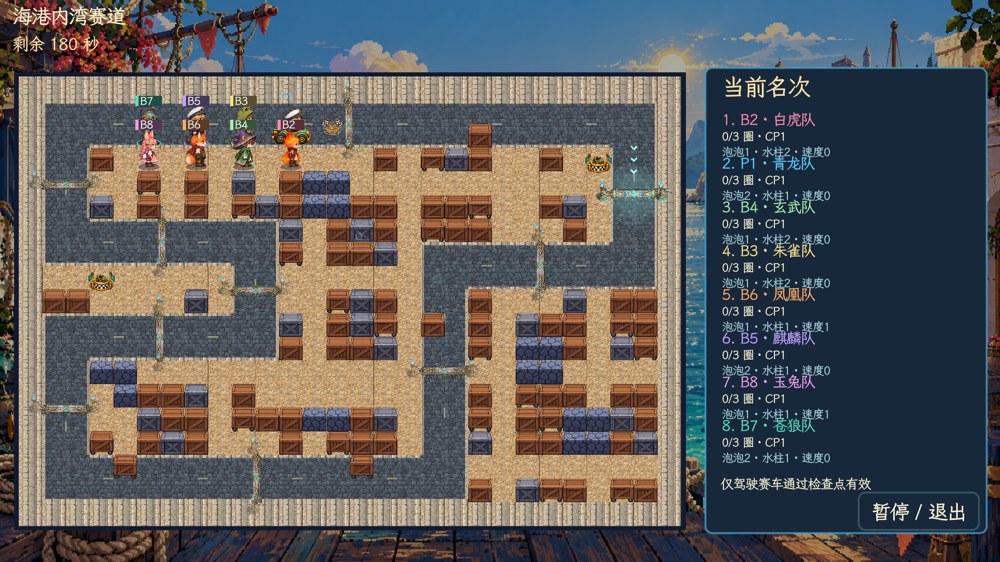
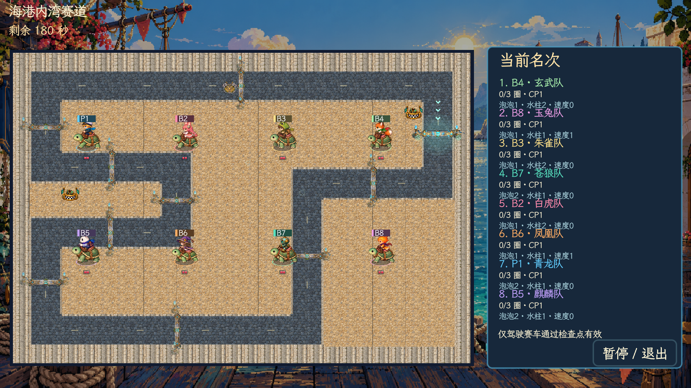
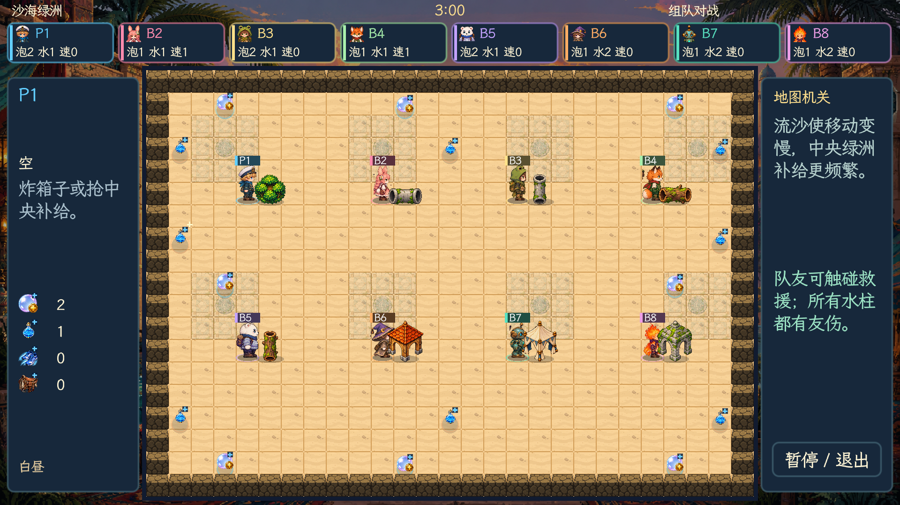
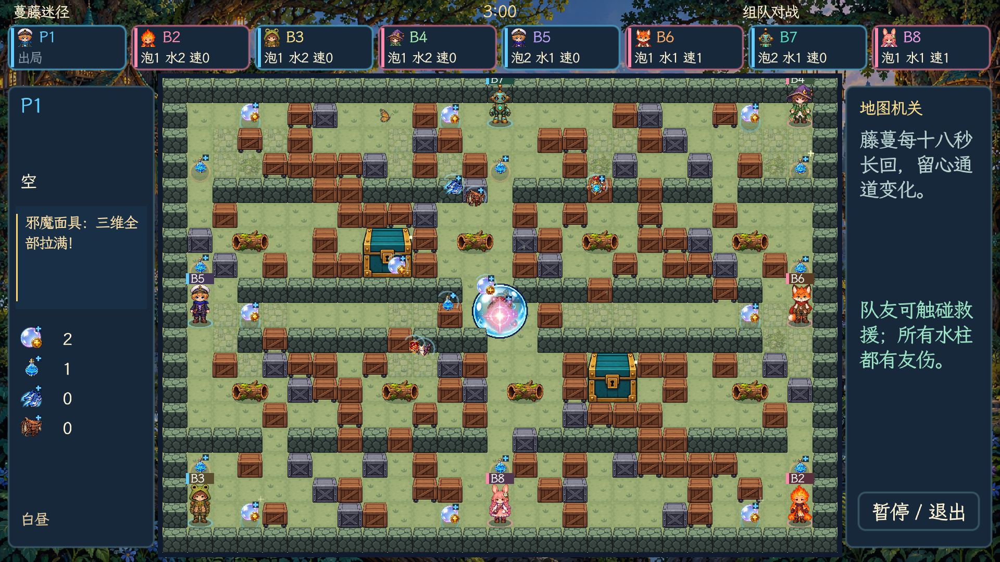

# 骑乘与掉落 · v4.9.5

角色与坐骑改用完整骑乘画面，死亡成长道具会飞散到地图各处。赛车界面把数值集中到右侧，单人可以看到整张赛道。

## 完整骑乘

八位角色分别骑乘泡泡鸭、甲壳龟、跳跳兔和赛车，共 32 组。每组包含下、上、左、右四方向，每方向四帧，共 512 帧。人物的坐姿、弯曲膝盖、鞍位、握缰绳或方向盘直接画在同一帧中，运行时整帧切换。

原图保存在 `assets/art/riding/`，由内置 imagegen 制作，生成提示词与原文件路径记录在 [制作记录](art-production/riding-v495.json)。PNG 保留生成器输出；`index_riding.py` 只分析透明间隔并生成裁切索引。角色主题色主要作用于上身衣物，避免给坐骑头部染色。

## 死亡掉落

返还范围为本局实际拾取的七类成长与稀有道具：泡泡扩容、水柱延伸、速度提升、骑术成长、高压核心、大力丸和邪魔面具。每次成功拾取记一件，死亡时按记录返还；角色自带初始属性不生成掉落。主动道具、坐骑和任务物品继续原规则。

道具从角色倒地位置沿抛物线飞向地图随机有效空地，落地前不能拾取。落点避开墙箱、地图外区域、泡泡、已有道具和即将爆炸的位置；飞行期间落点被占用，则重新分配，保留原道具数量。死亡同时清除骑术和泡泡伤害成长，避免复活后重复叠加。

## 赛车与场景

- 单人赛车镜头按实际地图尺寸适配，完整展示地图四边；多人继续独立分屏。
- 圈数与成长属性移到右侧排名行，取消赛场上方的额外数值块。
- 三张赛道的固定领车点都移到赛道外的连通补给湾，保留开局十二秒供车、每三十秒补货。
- 完成圈数后车手面向屏幕，在终点原地起伏庆祝、飘出星光。位置保持不动，等待其他车手结束；已完成者不会再次受到水柱伤害。
- 大厅、胜利横幅、赛车排名及队伍积分统一采用青龙、白虎、朱雀、玄武、麒麟、凤凰、苍狼、玉兔八个队名，并同步五种语言。
- 藏身灌木、管道、树干、小屋、帐篷和石亭调整世界尺寸、脚底接触阴影与主题色调，继续参与按落地位置排序的遮挡。

## 验证范围

使用真实 Godot 主场景、隔离存档完成导入启动、三图领车点连通、七类成长拾取与死亡返还、被占用落点重分配、冲线停止位移、单人完整地图边界检查。骑乘按四方向在原生渲染器中检查，包含实际主题色 shader；临时检查脚本、日志与完整截图保存在 `/tmp/paopaotang-v495-*`，没有增加单元测试。

三种难度 × 三张赛道共九场真实逻辑对局中，八名 Bot 均完成三圈并进入结束演出；这覆盖此次领车位置变化后的寻车和过点流程，不代表穷尽全部地图与机关组合。

macOS v4.9.5 应用与 ZIP 已重新构建并通过本地签名、压缩包完整性检查；从独立空目录加载打包 PCK，确认包含 32 张骑乘图集、512 帧、八个队名与赛道外领车点。
